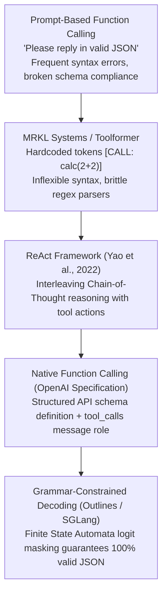

# 30. Tool Calling & Agentic JSON — Grammar-Enforced Execution & Autonomous Agents

> **Target Audience**: AI Agent Engineers, DevOps Automators, and Enterprise Software Architects building autonomous LLM agents that safely interact with production environments.  
> **Prerequisites**: JSON Schema / Pydantic basics, Python asynchronous programming, and OpenAI-compatible API interaction (from [15-vllm-serving-deepseek-and-qwen.md](15-vllm-serving-deepseek-and-qwen.md) and [28-litellm-proxy-gateway-load-balancing.md](28-litellm-proxy-gateway-load-balancing.md)).  
> **Estimated Study Time**: 65 minutes.  
> **What You Will Master**: The physical mechanics of **Grammar-Guided Constrained Decoding (FSA Logit Masking)**, the **ReAct (Reason + Act) loop**, authoring type-safe Pydantic tool schemas, building an autonomous **Kubernetes SRE Triage Agent**, and implementing air-gapped security guardrails on the **NVIDIA DGX Spark**.

---

## 📑 Table of Contents
1. [Foundational Scaffolding: The Brain in a Jar Dilemma](#1-foundational-scaffolding-the-brain-in-a-jar-dilemma)
2. [Co-Related Concepts & The Evolution of Autonomous Agents](#2-co-related-concepts--the-evolution-of-autonomous-agents)
3. [Deep First-Principles: Grammar-Guided Constrained Decoding Math](#3-deep-first-principles-grammar-guided-constrained-decoding-math)
4. [The ReAct (Reason + Act) State Machine Architecture](#4-the-react-reason--act-state-machine-architecture)
5. [Comparative Analysis: Native ReAct vs. LangGraph vs. CrewAI vs. AutoGen](#5-comparative-analysis-native-react-vs-langgraph-vs-crewai-vs-autogen)
6. [Hardware Grounding: Local Autonomous Execution on DGX Spark](#6-hardware-grounding-local-autonomous-execution-on-dgx-spark)
7. [Hands-On Python Lab: Autonomous Kubernetes SRE Triage Agent](#7-hands-on-python-lab-autonomous-kubernetes-sre-triage-agent)
8. [Enterprise Security Sandboxing & Human-in-the-Loop Guards](#8-enterprise-security-sandboxing--human-in-the-loop-guards)
9. [Practice Exercises with Step-by-Step Solutions](#9-practice-exercises-with-step-by-step-solutions)
10. [Troubleshooting Guide & Diagnostic Runbook](#10-troubleshooting-guide--diagnostic-runbook)

---

## 1. Foundational Scaffolding: The Brain in a Jar Dilemma

### The Limits of Pure Text Generation
Foundation models without external tool integration are like a brilliant philosopher trapped in a sensory deprivation chamber:
* **Stale Parametric Knowledge**: The model knows everything up to its pre-training cutoff date, but has no knowledge of current events, live database rows, or active server metrics.
* **Inability to Affect Reality**: An un-tooled LLM can describe how to fix a failing Kubernetes cluster, but cannot inspect live pod logs, execute `kubectl` commands, or restart crashed pods.
* **The Hallucinated JSON Nightmare**: When asking an unconstrained LLM to return JSON:
  * The model outputs polite conversational conversational padding: `"Certainly! Here is the JSON you requested:"`.
  * It forgets closing brackets or adds trailing commas, immediately crashing downstream code with `json.decoder.JSONDecodeError`.
  * It invents fictional function parameters (e.g., passing `"pod_id"` instead of `"pod_name"`).

### The Physician and Medical Lab Analogy
When a patient presents with abdominal pain, an experienced physician does not immediately hallucinate blood sugar levels or guess liver enzyme counts.
1. **Thought (Reason)**: *"The patient has symptoms consistent with pancreatitis or appendicitis. I need objective diagnostic data."*
2. **Action (Tool Execution)**: Orders a complete metabolic blood panel and an ultrasound.
3. **Observation (Environment Feedback)**: The lab reports elevated lipase levels (450 U/L).
4. **Conclusion (Resolution)**: Diagnoses acute pancreatitis and prescribes intravenous fluids.

This multi-turn loop—**Thought $\to$ Action $\to$ Observation $\to$ Thought $\to$ Final Answer**—is the foundational core of **Autonomous Agent Architecture**.

```
                           THE AUTONOMOUS AGENT LOOP
┌──────────────┐
│ User Request │ "Why is the deepseek-r1 pod in ai-inference failing?"
└──────────────┘
       │
       ▼
┌────────────────────────────────────────────────────────────────────────┐
│ STEP 1: REASONING (DeepSeek-R1 / Qwen2.5-Coder)                         │
│ <think> I need to check pod statuses in the ai-inference namespace </think>│
└────────────────────────────────────────────────────────────────────────┘
       │
       │ Emits Structured Tool Call: kubectl_get_pods(namespace="ai-inference")
       ▼
┌────────────────────────────────────────────────────────────────────────┐
│ STEP 2: TOOL EXECUTION RUNTIME (Sandboxed Python Engine)               │
│ - Executes 'kubectl get pods -n ai-inference -o json'                  │
│ - Captures cluster state: deepseek-r1-79b is in CrashLoopBackOff       │
└────────────────────────────────────────────────────────────────────────┘
       │
       │ Returns Observation JSON to LLM
       ▼
┌────────────────────────────────────────────────────────────────────────┐
│ STEP 3: SECOND REASONING PASS                                          │
│ <think> Pod is crash looping. I must read the last 50 lines of logs. </think>│
└────────────────────────────────────────────────────────────────────────┘
       │
       │ Emits Tool Call: kubectl_get_logs(pod_name="deepseek-r1-79b")
       ▼
┌────────────────────────────────────────────────────────────────────────┐
│ STEP 4: TOOL EXECUTION RUNTIME                                         │
│ - Captures log output: "torch.cuda.OutOfMemoryError"                   │
└────────────────────────────────────────────────────────────────────────┘
       │
       │ Returns Observation to LLM
       ▼
┌────────────────────────────────────────────────────────────────────────┐
│ STEP 5: FINAL DIAGNOSIS & REMEDIATION PLAN                             │
│ "Root Cause: Pod crashed due to CUDA Out-Of-Memory during warmup.      │
│  Fix: Lower --gpu-memory-utilization from 0.98 to 0.90 in deployment."  │
└────────────────────────────────────────────────────────────────────────┘
```

---

## 2. Co-Related Concepts & The Evolution of Autonomous Agents



---

## 3. Deep First-Principles: Grammar-Guided Constrained Decoding Math

Modern inference engines (vLLM, SGLang) eliminate JSON syntax errors using **Grammar-Guided Constrained Decoding**:

### How Finite State Automata (FSA) Logit Masking Works:
1. When a client submits a target JSON Schema or Pydantic model, the engine compiles it into a **Deterministic Finite Automaton (DFA)**.
2. At decoding step $t$, the automaton is in state $S_t$.
3. Based on state $S_t$, the automaton determines the exact subset of vocabulary tokens $\mathcal{V}_{\text{valid}} \subset \mathcal{V}$ that could legally continue the JSON string:
   * If the model just output `{"temperature": `, the next legal token **must be a number** (`0-9`), not a string quote or closing brace!
4. In the final Softmax layer, the engine sets all illegal token logits to $-\infty$:

$$z_i' = \begin{cases} z_i & \text{if token } i \in \mathcal{V}_{\text{valid}} \\ -\infty & \text{if token } i \notin \mathcal{V}_{\text{valid}} \end{cases}$$

$$P(x_t = i) = \frac{\exp(z_i')}{\sum_{j \in \mathcal{V}} \exp(z_j')}$$

```
                GRAMMAR-GUIDED LOGIT MASKING IN GPU REGISTERS
Target Schema: {"status": "ok" | "failed", "code": int}
State: Emitted '{"status": "'

VOCABULARY CANDIDATES:
- Token "ok"      ──► Legal! Logit: 14.2 ──► Preserved
- Token "failed"  ──► Legal! Logit: 12.1 ──► Preserved
- Token "apple"   ──► ILLEGAL! Logit: 9.5 ──► FORCED TO -∞!
- Token "}"       ──► ILLEGAL! Logit: 8.2 ──► FORCED TO -∞!

Result: Mathematically impossible for the model to emit a syntax or schema violation!
```

---

## 4. The ReAct (Reason + Act) State Machine Architecture

A production agent loop coordinates four core conversational roles:

| Message Role | Sender | Payload Content | Purpose |
| :--- | :--- | :--- | :--- |
| **`system`** | Developer | System instructions, available tool schemas, constraints | Sets operational boundaries |
| **`user`** | Human / Webhook | The goal or query to solve | Initiates the task |
| **`assistant`** | LLM Engine | Reasoning text + array of `tool_calls` | Emits internal logic & requested tool invocations |
| **`tool`** | Execution Engine| Raw JSON/text result of the tool execution (`tool_call_id`) | Provides sensory feedback back to the LLM |

The agent loops until the `assistant` emits a message containing **zero tool calls**, indicating that the problem is solved and the final answer is ready.

---

## 5. Comparative Analysis: Native ReAct vs. LangGraph vs. CrewAI vs. AutoGen

| Framework / Architecture | Execution Model | Memory & State Management | Production Predictability | Setup Complexity |
| :--- | :--- | :--- | :--- | :--- |
| **Native ReAct (This Module)**| Pure Python loop | Standard list of messages | **Highest (Zero hidden magic)** | **Lowest (Self-contained)** |
| **LangGraph (LangChain)** | StateGraph DAG nodes | TypedDict state checkpoints | High (Explicit edge routing) | High (Steep learning curve) |
| **CrewAI** | Role-playing personas | Vector memory + task lists | Low (Prone to chat loops) | Medium |
| **Microsoft AutoGen** | Multi-agent conversation | Conversational event bus | Medium | Medium |

---

## 6. Hardware Grounding: Local Autonomous Execution on DGX Spark

The **NVIDIA DGX Spark** is an ideal air-gapped agent environment:
* **The Brain**: `Qwen2.5-Coder-32B-Instruct` or `DeepSeek-R1-Distill-32B` runs on the **Blackwell GB10 GPU** (via vLLM on port 8000), delivering 75+ tokens/second.
* **The Hands**: The agent execution loop runs on the **72-core Grace ARM CPU**, executing local diagnostics, database queries, and Kubernetes commands with zero latency.
* **Total Air-Gap Isolation**: Zero tokens or corporate diagnostic logs ever leave the local chassis, satisfying strict enterprise compliance standards.

---

## 7. Hands-On Python Lab: Autonomous Kubernetes SRE Triage Agent

This complete script implements a self-contained autonomous SRE triage agent. It defines Pydantic tool schemas, inspects local Kubernetes clusters, diagnoses pod crashes, and reports root causes:

```python
#!/usr/bin/env python3
"""
k8s_triage_agent.py
Autonomous Kubernetes SRE Triage Agent with grammar-enforced tool execution.
"""

import json
import subprocess
import requests
from typing import Dict, Any, List
from pydantic import BaseModel, Field

INFERENCE_URL = "http://localhost:8000/v1/chat/completions"
MODEL_NAME = "qwen-coder"

# ==============================================================================
# 1. TOOL IMPLEMENTATIONS (THE HANDS)
# ==============================================================================

def tool_kubectl_get_pods(namespace: str) -> str:
    """Lists pods in a namespace with status and restart counts."""
    cmd = ["kubectl", "get", "pods", "-n", namespace, "-o", "json"]
    try:
        res = subprocess.run(cmd, capture_output=True, text=True, timeout=10)
        if res.returncode != 0:
            return json.dumps({"error": res.stderr.strip()})
        data = json.loads(res.stdout)
        summary = []
        for item in data.get("items", []):
            name = item["metadata"]["name"]
            status = item["status"]["phase"]
            container_statuses = item["status"].get("containerStatuses", [{}])[0]
            restart_count = container_statuses.get("restartCount", 0)
            waiting_reason = container_statuses.get("state", {}).get("waiting", {}).get("reason", "None")
            summary.append({
                "pod_name": name,
                "phase": status,
                "restarts": restart_count,
                "waiting_reason": waiting_reason
            })
        return json.dumps(summary, indent=2)
    except Exception as e:
        return json.dumps({"error": str(e)})

def tool_kubectl_get_logs(namespace: str, pod_name: str, tail_lines: int = 40) -> str:
    """Retrieves recent logs from a specific pod."""
    cmd = ["kubectl", "logs", pod_name, "-n", namespace, f"--tail={tail_lines}"]
    try:
        res = subprocess.run(cmd, capture_output=True, text=True, timeout=10)
        if res.returncode != 0:
            return json.dumps({"error": res.stderr.strip()})
        return res.stdout.strip() or "Log buffer empty."
    except Exception as e:
        return json.dumps({"error": str(e)})

# Dispatcher Map
TOOL_FUNCTIONS = {
    "get_pods": tool_kubectl_get_pods,
    "get_pod_logs": tool_kubectl_get_logs
}

# ==============================================================================
# 2. OPENAI FUNCTION SPECIFICATIONS (THE SCHEMA)
# ==============================================================================

TOOLS_SPEC = [
    {
        "type": "function",
        "function": {
            "name": "get_pods",
            "description": "Lists all Kubernetes pods in a given namespace to check their status and restart counts.",
            "parameters": {
                "type": "object",
                "properties": {
                    "namespace": {
                        "type": "string",
                        "description": "The target Kubernetes namespace (e.g. 'ai-inference', 'default')"
                    }
                },
                "required": ["namespace"]
            }
        }
    },
    {
        "type": "function",
        "function": {
            "name": "get_pod_logs",
            "description": "Fetches trailing stdout/stderr logs from a specific pod to inspect crash errors.",
            "parameters": {
                "type": "object",
                "properties": {
                    "namespace": {"type": "string", "description": "The Kubernetes namespace"},
                    "pod_name": {"type": "string", "description": "Exact name of the pod to inspect"},
                    "tail_lines": {"type": "integer", "description": "Number of log lines to retrieve (default: 40)"}
                },
                "required": ["namespace", "pod_name"]
            }
        }
    }
]

# ==============================================================================
# 3. AUTONOMOUS REACT AGENT EXECUTION LOOP
# ==============================================================================

def run_agent_investigation(goal_prompt: str, max_iterations: int = 5):
    print("=" * 70)
    print(f"AGENT MISSION INITIALIZED: {goal_prompt}")
    print("=" * 70)
    
    system_prompt = (
        "You are an expert autonomous SRE agent operating on NVIDIA DGX Spark infrastructure. "
        "Your duty is to triage cluster anomalies. Use your available tools methodically. "
        "Always inspect pod status first, retrieve error logs if crashing, and deliver a "
        "concise root-cause analysis with actionable remediation steps."
    )
    
    messages = [
        {"role": "system", "content": system_prompt},
        {"role": "user", "content": goal_prompt}
    ]

    for step in range(1, max_iterations + 1):
        print(f"\n[Iteration {step}/{max_iterations}] Querying reasoning model...")
        
        response = requests.post(
            INFERENCE_URL,
            json={
                "model": MODEL_NAME,
                "messages": messages,
                "tools": TOOLS_SPEC,
                "tool_choice": "auto",
                "temperature": 0.2
            },
            timeout=120
        ).json()

        message = response["choices"][0]["message"]
        messages.append(message)
        
        # Display thoughts if available
        if message.get("content"):
            print(f"\n\033[94m[Agent Reasoning]:\033[0m\n{message['content']}")

        # Check if the model requested tool execution
        tool_calls = message.get("tool_calls", [])
        if not tool_calls:
            print("\n" + "=" * 70)
            print("TRIAGE INVESTIGATION COMPLETE - FINAL CONCLUSION:")
            print("=" * 70)
            print(message["content"])
            return

        # Execute requested tools
        for tool_call in tool_calls:
            call_id = tool_call["id"]
            fn_name = tool_call["function"]["name"]
            raw_args = tool_call["function"]["arguments"]
            args = json.loads(raw_args) if isinstance(raw_args, str) else raw_args
            
            print(f"\n\033[93m-> Action:\033[0m Invoking `{fn_name}` with arguments: {args}")
            
            if fn_name in TOOL_FUNCTIONS:
                tool_output = TOOL_FUNCTIONS[fn_name](**args)
            else:
                tool_output = json.dumps({"error": f"Tool '{fn_name}' not registered!"})
                
            print(f"\033[92m<- Observation:\033[0m {tool_output[:120]}... (truncated)")

            # Return tool observation back to conversational history
            messages.append({
                "role": "tool",
                "tool_call_id": call_id,
                "content": str(tool_output)
            })

    print("\n[!] Agent reached maximum iteration limit before finding a definitive conclusion.")

if __name__ == "__main__":
    run_agent_investigation("Investigate why pods in the 'ai-inference' namespace are unstable.")
```

---

## 8. Enterprise Security Sandboxing & Human-in-the-Loop Guards

Giving an autonomous AI agent the power to execute shell commands or API mutations requires strict architectural security boundaries:

```
┌────────────────────────────────────────────────────────────────────────┐
│                        AGENT SECURITY ENVELOPE                         │
├────────────────────────────────────────────────────────────────────────┤
│ 1. READ-ONLY RBAC SERVICEACCOUNT                                       │
│    - The agent's Kubernetes kubeconfig MUST be bound to a ClusterRole │
│      granting ONLY 'get', 'list', and 'watch'.                         │
│    - Any attempt to execute 'delete', 'create', or 'patch' triggers an │
│      immediate HTTP 403 Forbidden!                                     │
├────────────────────────────────────────────────────────────────────────┤
│ 2. DANGEROUS COMMAND BLOCKLIST REGEX                                   │
│    - A pre-execution interceptor inspects tool arguments.              │
│    - Blocks strings containing: rm -rf, drop table, kill, delete.      │
├────────────────────────────────────────────────────────────────────────┤
│ 3. HUMAN-IN-THE-LOOP APPROVAL GATE                                     │
│    - If an action modifies cluster state (e.g. 'restart_pod'), the     │
│      agent pauses and generates an approval webhook to a human SRE.   │
└────────────────────────────────────────────────────────────────────────┘
```

---

## 9. Practice Exercises with Step-by-Step Solutions

### Exercise 1: Authoring a Pydantic Tool Schema with Strict Validation
**Scenario**: You want to provide your agent a tool that restarts a failed deployment: `restart_deployment(namespace, deployment_name)`.
To prevent accidents, `namespace` must be strictly validated to be either `"ai-inference"` or `"ai-serving"`, and cannot be `"kube-system"`.
**Question**: Write the Pydantic model enforcing this constraint and generate its JSON schema.

#### Solution:
```python
from pydantic import BaseModel, Field, field_validator
from typing import Literal

class RestartDeploymentSchema(BaseModel):
    namespace: Literal["ai-inference", "ai-serving"] = Field(
        ..., 
        description="The target namespace. Restrictive to AI namespaces only."
    )
    deployment_name: str = Field(
        ..., 
        min_length=3, 
        max_length=64, 
        description="Exact name of the deployment to roll out restart."
    )

# Export to OpenAI-compatible Tool Specification
json_tool_schema = {
    "type": "function",
    "function": {
        "name": "restart_deployment",
        "description": "Performs a rolling restart of a deployment in approved AI namespaces.",
        "parameters": RestartDeploymentSchema.model_json_schema()
    }
}
print(json.dumps(json_tool_schema, indent=2))
```

---

### Exercise 2: Preventing Infinite Loop Flapping
**Scenario**: A poorly prompted agent enters an infinite loop: it calls `get_pods()`, receives an observation, decides to call `get_pods()` again with identical arguments, and continues forever.
**Question**: Propose two algorithmic mechanisms in the agent loop to detect and break repeated tool-calling loops.

#### Solution:
1. **Tool History Fingerprinting**:
   * Maintain a rolling hash list of the last 3 `(tool_name, arguments)` pairs.
   * If `(tool_name, args)` at step $T$ is identical to step $T-1$, immediately inject an error observation:
     `{"error": "Repeated identical call detected. You already have this information. Synthesize your final conclusion now."}`
2. **Hard Iteration Guard**:
   * Enforce `max_iterations = 5` in the outer loop. When `step == max_iterations`, force `tool_choice="none"`, requiring the model to emit a text response.

---

## 10. Troubleshooting Guide & Diagnostic Runbook

### Issue 1: `json.decoder.JSONDecodeError` When Parsing Tool Arguments
* **Root Cause**: The model emitted invalid JSON strings (such as unescaped newlines inside strings) because grammar-constrained decoding was not enabled on the serving engine.
* **Remediation**: In vLLM / SGLang, ensure `--enable-auto-tool-choice` and `--tool-call-parser=hermes` (or `llama3`/`qwen`) are enabled.

### Issue 2: Agent Hangs on `subprocess.run()`
* **Root Cause**: The invoked CLI command is waiting for interactive user stdin confirmation (e.g. `Do you want to continue? [Y/n]`).
* **Remediation**: Always pass non-interactive flags (e.g., `-y` or `--non-interactive`) and configure a hard timeout:
  ```python
  subprocess.run(cmd, timeout=10)
  ```

---

## 🔗 Related Curriculum Modules
* **Underlying Serving Engine**: [15-vllm-serving-deepseek-and-qwen.md](15-vllm-serving-deepseek-and-qwen.md)
* **Radix Tree Fast State Caching**: [16-sglang-and-radix-attention-serving.md](16-sglang-and-radix-attention-serving.md)
* **Enterprise Gateway Load Balancing**: [28-litellm-proxy-gateway-load-balancing.md](28-litellm-proxy-gateway-load-balancing.md)
* **Enterprise RAG Knowledge Base**: [29-enterprise-rag-with-qdrant-and-bge.md](29-enterprise-rag-with-qdrant-and-bge.md)
