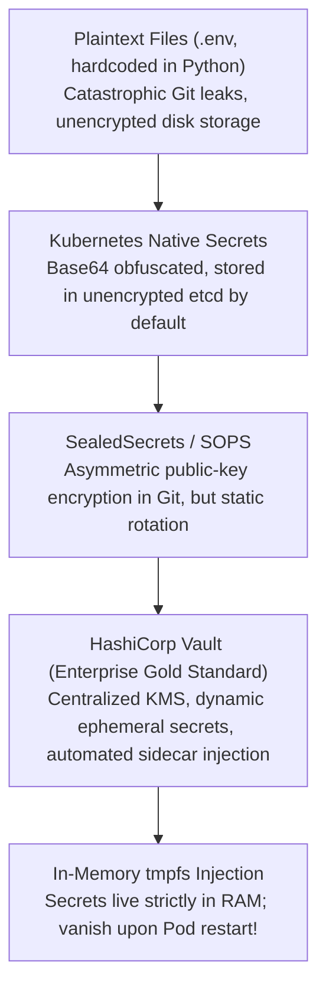
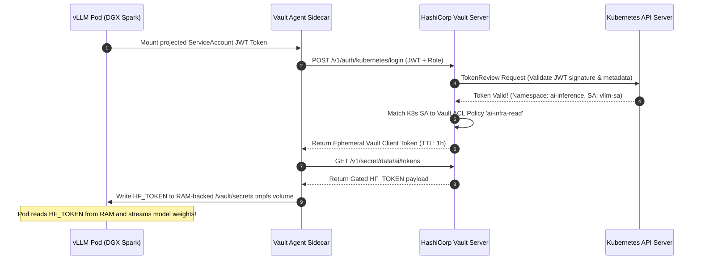

# 32. HashiCorp Vault Secrets Integration — Zero-Trust Credential Injection

> **Target Audience**: Enterprise Security Engineers, DevSecOps Specialists, and Cloud-Native Platform Administrators implementing air-gapped secret management.  
> **Prerequisites**: Public Key Infrastructure (PKI), Kubernetes ServiceAccounts and RBAC (from [19-kubernetes-manifests-for-deepseek.md](19-kubernetes-manifests-for-deepseek.md)), and HashiCorp Vault fundamentals.  
> **Estimated Study Time**: 55 minutes.  
> **What You Will Master**: Zero-Trust security principles for AI clusters, configuring **Vault KV-v2 secrets engines**, machine-to-machine authentication via **AppRole & Kubernetes JWT**, in-memory **`tmpfs` credential injection**, and securing gated model downloads on the **NVIDIA DGX Spark**.

---

## 📑 Table of Contents
1. [Foundational Scaffolding: The Secret-Zero Problem in AI Clusters](#1-foundational-scaffolding-the-secret-zero-problem-in-ai-clusters)
2. [Co-Related Concepts & The Evolution of Secrets Management](#2-co-related-concepts--the-evolution-of-secrets-management)
3. [Deep First-Principles: Cryptographic Foundations & Shamir's Secret Sharing](#3-deep-first-principles-cryptographic-foundations--shamirs-secret-sharing)
4. [Kubernetes ServiceAccount JWT Validation Sequence](#4-kubernetes-serviceaccount-jwt-validation-sequence)
5. [Comparative Analysis: HashiCorp Vault vs. AWS Secrets Manager vs. SealedSecrets](#5-comparative-analysis-hashicorp-vault-vs-aws-secrets-manager-vs-sealedsecrets)
6. [Hardware Grounding: Air-Gapped Security on NVIDIA DGX Spark](#6-hardware-grounding-air-gapped-security-on-nvidia-dgx-spark)
7. [Production Vault Server Configuration Runbook (KV-v2 & AppRole)](#7-production-vault-server-configuration-runbook-kv-v2--approle)
8. [Kubernetes Manifest: In-Memory `tmpfs` Vault Agent Injection](#8-kubernetes-manifest-in-memory-tmpfs-vault-agent-injection)
9. [Automated Secret Retrieval via Ansible Playbooks](#9-automated-secret-retrieval-via-ansible-playbooks)
10. [Practice Exercises with Step-by-Step Solutions](#10-practice-exercises-with-step-by-step-solutions)
11. [Troubleshooting Guide & Diagnostic Runbook](#11-troubleshooting-guide--diagnostic-runbook)

---

## 1. Foundational Scaffolding: The Secret-Zero Problem in AI Clusters

### The Danger of Hardcoded Credentials
To download gated frontier foundation models (such as **Meta Llama 3.3** or proprietary internal checkpoints) and authenticate against enterprise databases, inference engines require sensitive credentials:
* Hugging Face API User Access Tokens (`hf_...`).
* Enterprise LiteLLM Gateway Master Keys (`sk-...`).
* PostgreSQL database connection strings and passwords.

In immature AI infrastructure, developers hardcode these tokens inside Dockerfiles, Git repositories, or standard Kubernetes Secret objects.
**The Base64 Fallacy**: Standard Kubernetes Secrets (`kubectl get secret -o yaml`) are merely **Base64 encoded strings, NOT encrypted data**. Anyone with read access to the namespace can decode them in under 1 second:
```bash
echo "aGZfYWJjMTIz..." | base64 --decode  # REVEALS RAW PRIVATE API KEY!
```

### The Hotel Electronic Keycard Analogy
Hardcoding a master API token in code is like stamping a permanent brass key that opens every executive door in your corporate headquarters: if an employee loses the brass key or an intruder photographs it, **you must physically replace every single deadbolt in the building**.
**HashiCorp Vault** is like an electronic hotel keycard system:
* The keycard is minted dynamically upon arrival.
* It is tied to a specific verified employee badge (**Kubernetes ServiceAccount JWT**).
* It expires automatically after 60 minutes (**Time-To-Live [TTL]**).
* If compromised, the security desk revokes the keycard instantly with zero lock changes!

```
                  TRADITIONAL LEAKY SECRETS VS. ZERO-TRUST VAULT
┌──────────────────────────────────────┐     ┌──────────────────────────────────────┐
│       Traditional Anti-Pattern       │     │         Zero-Trust Vault Pattern     │
│  - Static HF_TOKEN in Git / ENV      │     │  - Ephemeral short-lived leases      │
│  - Written to physical NVMe disk     │     │  - Injected strictly into RAM (tmpfs)│
│  - Lives forever until leaked        │     │  - Automatically rotated hourly      │
│  - Compromise blast radius: Fatal    │     │  - Audit logged per single invocation│
└──────────────────────────────────────┘     └──────────────────────────────────────┘
```

---

## 2. Co-Related Concepts & The Evolution of Secrets Management



---

## 3. Deep First-Principles: Cryptographic Foundations & Shamir's Secret Sharing

HashiCorp Vault secures data using two foundational cryptographic principles:

### 1. Envelope Encryption with AES-256-GCM
All secrets stored in the KV-v2 engine are encrypted using an ephemeral **Data Encryption Key (DEK)** via AES-256 in Galois/Counter Mode (GCM). The DEK is itself encrypted with a master **Key Encryption Key (KEK)** protected by the Vault storage barrier.

### 2. Shamir's Secret Sharing Algorithm
To prevent a single rogue administrator from compromising the master key, Vault splits the master unseal key into $N$ mathematical shares using polynomial interpolation:

$$f(x) = a_0 + a_1 x + a_2 x^2 + \dots + a_{k-1} x^{k-1} \pmod p$$

Where $a_0 = S$ is the master secret.
* Any threshold subset of **$K$ out of $N$ unseal keys** can reconstruct the polynomial $f(0) = S$.
* Any subset of $K - 1$ keys reveals **mathematically zero information** about the secret.

---

## 4. Kubernetes ServiceAccount JWT Validation Sequence

When a vLLM Pod boots on the DGX Spark, it authenticates with Vault without requiring any human passwords:



---

## 5. Comparative Analysis: HashiCorp Vault vs. AWS Secrets Manager vs. SealedSecrets

| Dimension / Metric | HashiCorp Vault | AWS Secrets Manager | Bitnami SealedSecrets |
| :--- | :--- | :--- | :--- |
| **Primary Domain** | **Hybrid / Multi-Cloud & Bare-Metal**| AWS Cloud Only | Kubernetes GitOps Only |
| **Air-Gapped On-Prem Support**| **100% Native (Self-Hosted)** | No (Requires AWS WAN connection) | Yes |
| **Dynamic Secrets** | **Yes (Generates on-the-fly leases)**| Yes (Via Lambda rotation) | No (Static encryption only) |
| **In-Memory tmpfs Injection**| **Yes (Native Vault Agent)** | Requires custom sidecar | Native K8s Secret |
| **Authentication Methods** | K8s JWT, AppRole, LDAP, OIDC, TLS | IAM Roles for ServiceAccounts | K8s Controller Controller Key |

---

## 6. Hardware Grounding: Air-Gapped Security on NVIDIA DGX Spark

On the **NVIDIA DGX Spark**, security boundaries must protect local NVMe storage:
* **The `tmpfs` Imperative**: By using the Vault Agent Sidecar, secrets are written directly to an in-memory **`tmpfs`** filesystem.
* When model weights finish downloading into `/data/models`, the API credentials evaporate from RAM the moment the pod is torn down, leaving **zero residual credential traces on the physical PCIe Gen5 NVMe disk**.

---

## 7. Production Vault Server Configuration Runbook (KV-v2 & AppRole)

Execute these commands on your enterprise Vault server:

### Step 1: Enable the KV-v2 Secrets Engine & Store Credentials
```bash
# Enable KV-v2 engine at path 'secret'
vault secrets enable -path=secret kv-v2

# Store Hugging Face gated model token and gateway master key
vault kv put secret/ai/tokens \
  hf_token="hf_aBcDeFgHiJkLmNoPqRsTuVwXyZ012345" \
  litellm_master_key="sk-vault-enterprise-secret-key-99"

# Verify secret storage
vault kv get secret/ai/tokens
```

### Step 2: Create a Least-Privilege ACL Policy (`ai-infra-policy.hcl`)
```hcl
# Restrict access strictly to read-only on AI tokens
path "secret/data/ai/tokens" {
  capabilities = ["read"]
}

# Allow renewing token leases
path "auth/token/renew-self" {
  capabilities = ["update"]
}
```

Apply the policy:
```bash
vault policy write ai-infra-read ai-infra-policy.hcl
```

### Step 3: Configure AppRole for Ansible & Automation
```bash
# Enable AppRole authentication
vault auth enable approle

# Define the DGX Spark machine role
vault write auth/approle/role/dgx-spark-role \
  token_policies="ai-infra-read" \
  token_ttl=1h \
  token_max_ttl=4h \
  secret_id_ttl=24h

# Extract Role ID and Secret ID for Ansible
vault read -field=role_id auth/approle/role/dgx-spark-role/role-id > /tmp/vault_role_id
vault write -f -field=secret_id auth/approle/role/dgx-spark-role/secret-id > /tmp/vault_secret_id
```

---

## 8. Kubernetes Manifest: In-Memory `tmpfs` Vault Agent Injection

Deploy this manifest to download gated models with automated, memory-only secret injection:

```yaml
apiVersion: v1
kind: ServiceAccount
metadata:
  name: vllm-serving-sa
  namespace: ai-inference
---
apiVersion: apps/v1
kind: Deployment
metadata:
  name: vllm-gated-serving
  namespace: ai-inference
spec:
  replicas: 1
  selector:
    matchLabels:
      app: vllm-gated
  template:
    metadata:
      labels:
        app: vllm-gated
      annotations:
        # Activate Vault Agent Sidecar Injector
        vault.hashicorp.com/agent-inject: "true"
        vault.hashicorp.com/role: "dgx-spark-role"
        # Secret path in Vault KV-v2
        vault.hashicorp.com/agent-inject-secret-credentials: "secret/data/ai/tokens"
        # Template formatting secret directly into shell environment syntax
        vault.hashicorp.com/agent-inject-template-credentials: |
          {{- with secret "secret/data/ai/tokens" -}}
          export HF_TOKEN="{{ .Data.data.hf_token }}"
          export LITELLM_KEY="{{ .Data.data.litellm_master_key }}"
          {{- end -}}
    spec:
      serviceAccountName: vllm-serving-sa
      containers:
      - name: vllm-engine
        image: vllm/vllm-openai:latest
        imagePullPolicy: IfNotPresent
        command: ["/bin/bash", "-c"]
        args:
          - |
            # Source credentials injected by Vault Agent into in-memory tmpfs!
            source /vault/secrets/credentials
            echo "[*] Credentials loaded into memory. Launching inference engine..."
            python3 -m vllm.entrypoints.openai.api_server \
              --model meta-llama/Llama-3.3-70B-Instruct-FP8 \
              --port 8000 \
              --gpu-memory-utilization 0.90
        ports:
          - containerPort: 8000
        resources:
          limits:
            nvidia.com/gpu: "1"
            memory: "96Gi"
            cpu: "24"
```

---

## 9. Automated Secret Retrieval via Ansible Playbooks

Incorporate dynamic Vault lookups into Ansible playbooks without writing secrets to disk:

```yaml
- name: Retrieve Gated Hugging Face Token from Vault Server
  community.hashi_vault.vault_kv2_get:
    url: 'https://vault.company.internal:8200'
    engine_mount_point: 'secret'
    path: 'ai/tokens'
    auth_method: 'approle'
    role_id: "{{ lookup('file', '/tmp/vault_role_id') }}"
    secret_id: "{{ lookup('file', '/tmp/vault_secret_id') }}"
  register: vault_response
  no_log: true # Prevent sensitive token from printing in Ansible console logs!

- name: Set Token as In-Flight Memory Variable
  ansible.builtin.set_fact:
    in_flight_hf_token: "{{ vault_response.data.data.hf_token }}"
  no_log: true

- name: Pre-Warm Gated Model Using In-Memory Token
  ansible.builtin.shell: |
    export HF_TOKEN="{{ in_flight_hf_token }}"
    export HF_HUB_ENABLE_HF_TRANSFER=1
    huggingface-cli download meta-llama/Llama-3.3-70B-Instruct-FP8 \
      --local-dir /data/models/Llama-3.3-70B-FP8 \
      --local-dir-use-symlinks False
  no_log: true
```

---

## 10. Practice Exercises with Step-by-Step Solutions

### Exercise 1: Authoring Least-Privilege Vault HCL Policies
**Scenario**: You have an automated CI/CD pipeline that fine-tunes models. The pipeline needs to **read** `secret/data/ai/tokens` and **write** new adapter metadata to `secret/data/ai/adapters/*`, but must be strictly blocked from accessing `secret/data/enterprise/finance/*`.
**Question**: Author the exact Vault HCL policy satisfying these least-privilege requirements.

#### Solution:
```hcl
# Read-only access to base tokens
path "secret/data/ai/tokens" {
  capabilities = ["read"]
}

# Read, create, and update permissions on adapters
path "secret/data/ai/adapters/*" {
  capabilities = ["create", "read", "update"]
}

# Explicit denial of finance secrets
path "secret/data/enterprise/finance/*" {
  capabilities = ["deny"]
}
```

---

### Exercise 2: Understanding Secret Lease Expiration Math
**Scenario**: Vault issues an AppRole token with:
* `token_ttl = "1h"` (1 hour initial lease).
* `token_max_ttl = "4h"` (4 hours maximum hard lease ceiling).
* A long-running training job renews its token every 30 minutes.

**Question**: At what hour will the training job be forcibly revoked, even if it continues renewing every 30 minutes?

#### Solution:
* While `token_ttl` allows resetting the lease counter back to 1 hour upon every renewal, **`token_max_ttl` is an absolute cryptographic ceiling**.
* No renewal operation can extend a token's lifespan beyond `token_max_ttl`.
* **Result**: At exactly **$t = 4.0 \text{ hours}$**, Vault will irrevocably revoke the token, requiring the application to re-authenticate using its Role ID and Secret ID.

---

## 11. Troubleshooting Guide & Diagnostic Runbook

### Issue 1: `permission denied` on Vault Agent Sidecar Injection
* **Root Cause**: The Kubernetes ServiceAccount mounted in the Pod does not match the bound ServiceAccount configured in the Vault Kubernetes auth role.
* **Remediation**: Verify the bound ServiceAccount in Vault:
  ```bash
  vault read auth/kubernetes/role/dgx-spark-role
  # Ensure 'bound_service_account_names' includes 'vllm-serving-sa'
  ```

### Issue 2: `source: /vault/secrets/credentials: No such file or directory`
* **Root Cause**: The main application container started before the Vault Agent sidecar finished authenticating and rendering the secret file.
* **Remediation**: Add a wait loop in the container entrypoint:
  ```bash
  until [ -f /vault/secrets/credentials ]; do echo 'Waiting for Vault Agent...'; sleep 1; done
  source /vault/secrets/credentials
  ```

---

## 🔗 Related Curriculum Modules
* **Automated Ansible Playbooks**: [31-ansible-one-click-deployment-playbook.md](31-ansible-one-click-deployment-playbook.md)
* **Kubernetes Deployments**: [19-kubernetes-manifests-for-deepseek.md](19-kubernetes-manifests-for-deepseek.md)
* **Automated Day-2 Operations**: [33-automated-weight-sync-and-day2-ops.md](33-automated-weight-sync-and-day2-ops.md)
* **API Gateway Authentication**: [28-litellm-proxy-gateway-load-balancing.md](28-litellm-proxy-gateway-load-balancing.md)
