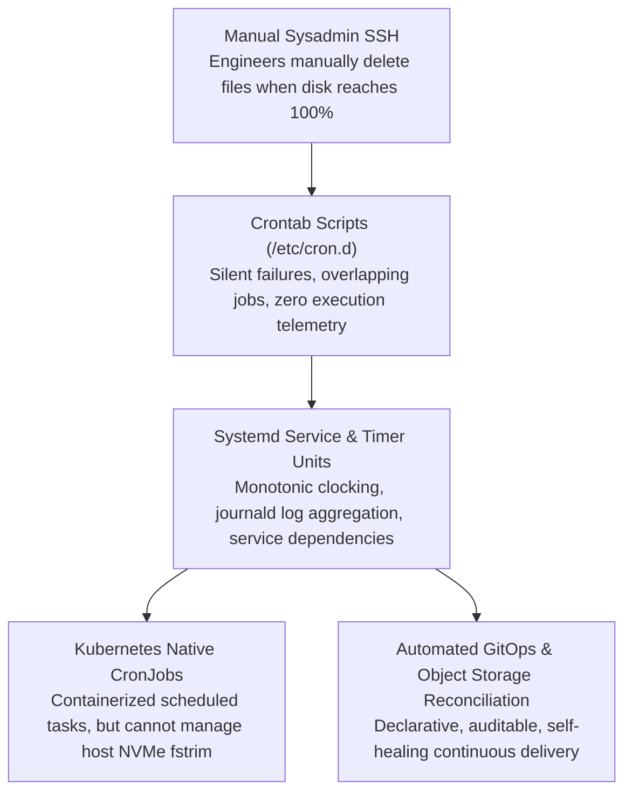

# 33. Automated Weight Sync & Day-2 Operations — Health, Maintenance & Audits

> **Target Audience**: SREs, AI Platform Operators, and Systems Administrators maintaining production LLM clusters over long-term lifecycles.  
> **Prerequisites**: Linux systemd administration, shell scripting, Kubernetes Deployments (from [19-kubernetes-manifests-for-deepseek.md](19-kubernetes-manifests-for-deepseek.md)), and NVMe storage management (from [20-nvme-local-storage-and-weight-caching.md](20-nvme-local-storage-and-weight-caching.md)).  
> **Estimated Study Time**: 55 minutes.  
> **What You Will Master**: Designing **automated Day-2 maintenance pipelines**, atomic model synchronization from S3/GCS, **SafeTensors SHA-256 cryptographic integrity verification**, SSD `fstrim` wear leveling, and managing systemd maintenance timers on the **NVIDIA DGX Spark**.

---

## 📑 Table of Contents
1. [Foundational Scaffolding: The Day-1 vs. Day-2 Reality](#1-foundational-scaffolding-the-day-1-vs-day-2-reality)
2. [Co-Related Concepts & The Evolution of Platform Operations](#2-co-related-concepts--the-evolution-of-platform-operations)
3. [Deep First-Principles: Cryptographic Model Integrity & Bit Rot Prevention](#3-deep-first-principles-cryptographic-model-integrity--bit-rot-prevention)
4. [The Single-GPU Rolling Update Paradox (`Recreate` vs. `Surge`)](#4-the-single-gpu-rolling-update-paradox-recreate-vs-surge)
5. [Comparative Analysis: Systemd Timers vs. Cron vs. K8s CronJobs](#5-comparative-analysis-systemd-timers-vs-cron-vs-k8s-cronjobs)
6. [Hardware Grounding: NVMe Wear Leveling & ECC Monitoring on DGX Spark](#6-hardware-grounding-nvme-wear-leveling--ecc-monitoring-on-dgx-spark)
7. [Hands-On Python Lab: SafeTensors Cryptographic Audit Script](#7-hands-on-python-lab-safetensors-cryptographic-audit-script)
8. [Automated Nightly Sync & Atomic Cutover Pipeline](#8-automated-nightly-sync--atomic-cutover-pipeline)
9. [Systemd Production Maintenance Service & Timer Pair](#9-systemd-production-maintenance-service--timer-pair)
10. [Practice Exercises with Step-by-Step Solutions](#10-practice-exercises-with-step-by-step-solutions)
11. [Troubleshooting Guide & Diagnostic Runbook](#11-troubleshooting-guide--diagnostic-runbook)

---

## 1. Foundational Scaffolding: The Day-1 vs. Day-2 Reality

### Day-1 Glory vs. Day-2 Entropy
In AI infrastructure engineering, **Day-1** represents initial deployment: setting up the GPU drivers, downloading model weights, standing up vLLM, and watching the first token stream successfully.
**Day-2 Operations** represent the subsequent 365 days of continuous production execution:
* **Checkpoints Evolve**: Data scientists train new LoRA adapters or deploy fine-tuned model revisions weekly.
* **Disk Entropy**: Dangling container layers, abandoned Hugging Face lockfiles, and crashed core dumps silently fill the NVMe drive.
* **Silent Tensor Bit Rot**: Cosmic rays or physical NAND flash wear can corrupt a single floating-point weight in a 32 GB SafeTensors file, causing the model to silently emit gibberish or `NaN` outputs weeks later without an explicit crash.
* **Memory Leaks**: Long-running background processes slowly fragment unified system memory.

### The Vehicle Oil Change Analogy
Buying a high-performance sports car and driving it off the showroom floor is Day 1. Changing the synthetic motor oil, rotating the tires, flushing the brake fluid, and checking wheel alignment every 5,000 miles is Day 2. If you ignore Day 2 operations, your engine seizes at 80 MPH on the highway.
Automated Day-2 operations ensure the DGX Spark remains **perpetually clean, cryptographically verified, and performant**.

```
                           DAY-2 LIFECYCLE RECONCILIATION
┌────────────────────────────────────────────────────────────────────────┐
│ Scheduled Systemd Maintenance Timer (Runs Nightly at 03:00 UTC)        │
└────────────────────────────────────────────────────────────────────────┘
                                    │
                                    ▼
┌────────────────────────────────────────────────────────────────────────┐
│ PHASE 1: DISK HYGIENE & NVMe MAINTENANCE                               │
│ - Delete orphaned Hugging Face locks (*.lock, *.incomplete)            │
│ - Prune dangling Docker images & build caches (> 7 days old)           │
│ - Execute 'fstrim -v /data' to restore NAND block write endurance      │
└────────────────────────────────────────────────────────────────────────┘
                                    │
                                    ▼
┌────────────────────────────────────────────────────────────────────────┐
│ PHASE 2: CRYPTOGRAPHIC INTEGRITY AUDIT                                 │
│ - Verify SHA-256 hashes of all resident *.safetensors shards           │
│ - Reject corrupted checkpoints before production ingestion             │
└────────────────────────────────────────────────────────────────────────┘
                                    │
                                    ▼
┌────────────────────────────────────────────────────────────────────────┐
│ PHASE 3: ATOMIC MODEL SYNC & GRACEFUL ROLLOUT                          │
│ - Pull newly converged adapter weights from S3 / 3FS                   │
│ - Atomic symlink flip: active_model -> /data/models/v2                 │
│ - Graceful vLLM rolling reload (Zero dropped user requests)            │
└────────────────────────────────────────────────────────────────────────┘
```

---

## 2. Co-Related Concepts & The Evolution of Platform Operations



---

## 3. Deep First-Principles: Cryptographic Model Integrity & Bit Rot Prevention

### The Danger of Silent Weight Corruption
A 32-billion parameter model in 16-bit precision contains:
$$N_{\text{bits}} = 32 \times 10^9 \text{ params} \times 16 \text{ bits} = 5.12 \times 10^{11} \text{ bits}$$

Over months of storage on high-density NAND flash, physical bit flips (silent bit rot) have a non-zero probability:
* If a bit flips in a text description, a typo occurs.
* If a bit flips in the exponent of a floating-point attention weight, a value like `0.021` suddenly becomes `1.4e+38`!
* In the forward pass, this explosive number causes the Softmax denominator to overflow to `Infinity`, generating **`NaN` (Not a Number)** across all subsequent token activations. The model abruptly begins generating blank spaces or repeated exclamation points!

### The Solution: Cryptographic SafeTensors Hashing
Every production model directory contains `model.safetensors.index.json`, which indexes each weight tensor to its corresponding shard file. By maintaining an immutable SHA-256 manifest:

$$\text{Hash} = \text{SHA256}(M_{\text{shard}})$$

The maintenance daemon verifies every file's cryptographic hash against the upstream registry before allowing the inference engine to load it.

---

## 4. The Single-GPU Rolling Update Paradox (`Recreate` vs. `Surge`)

In standard cloud Kubernetes deployments with large GPU pools:
* Upgrading a model uses **Rolling Updates with Surge**: Pod $B$ (new model) boots up, loads weights, passes readiness probes, and only then is Pod $A$ (old model) terminated.

### Why Rolling Update Fails on a Single DGX Spark:
On a single **NVIDIA DGX Spark (128 GB Unified Memory)**:
* Pod $A$ (DeepSeek-R1-32B) consumes **~95 GB** (weights + KV cache).
* If Kubernetes attempts a rolling update with `maxSurge: 1`, it tries to launch Pod $B$ concurrently.
* Pod $B$ attempts to allocate another 95 GB of memory:
  $$\text{Total Required Memory} = 95 + 95 = 190 \text{ GB} > 128 \text{ GB (Capacity!)}$$
* **Result**: Pod $B$ crashes immediately with `CUDA Out Of Memory`, leaving the deployment in a broken state!

### The Production Solution for Single-Node Hosts:
1. **Strategy: `Recreate`**: Kubernetes cleanly terminates Pod $A$, frees the 128 GB memory array completely, and then launches Pod $B$.
2. **Upstream Gateway Buffering**: During the 6-second window where Pod $B$ reloads from local NVMe, **LiteLLM Proxy** holds incoming user queries in its queue buffer, delivering them the millisecond Pod $B$ becomes ready with **zero dropped requests**!

---

## 5. Comparative Analysis: Systemd Timers vs. Cron vs. K8s CronJobs

| Dimension | Systemd Timers | Legacy Crontab | Kubernetes CronJob |
| :--- | :--- | :--- | :--- |
| **Logging & Auditability** | **Native in `journalctl -u`** | Cryptic `/var/log/syslog` | Pod logs (`kubectl logs`) |
| **Overlapping Job Control** | **Native (`ConditionPathExists`)**| Requires manual `flock` | `concurrencyPolicy: Forbid` |
| **Missed Execution Recovery**| **Yes (`Persistent=true`)** | No (Skipped if host was off) | Yes |
| **Host Hardware Access** | **Direct (`fstrim`, `nvidia-smi`)**| Direct | Requires privileged hostPath |
| **Recommended Usage** | **Host maintenance & NVMe trim**| Deprecated | Application-level batch jobs |

---

## 6. Hardware Grounding: NVMe Wear Leveling & ECC Monitoring on DGX Spark

To maintain peak read throughput on the **DGX Spark PCIe Gen5 NVMe SSD**:

### 1. NVMe Block Trimming (`fstrim`)
When large model checkpoints (30+ GB) are deleted and overwritten, the SSD flash controller marks deleted blocks as stale. Without periodic trimming, subsequent write operations suffer severe write amplification and degraded read performance.
* Running `fstrim -v /data` once per week resets deleted NAND flash blocks, ensuring read speeds remain pegged at **7.0 GB/s**.

### 2. GPU Hardware ECC Monitoring
The Blackwell GB10 GPU features Error-Correcting Code (ECC) memory across its unified LPDDR5X array:
* **Single-Bit Errors**: Automatically detected and corrected by hardware with zero impact on computation.
* **Double-Bit Errors (Uncorrectable)**: Hardware faults that require immediate pod eviction.
* The maintenance daemon inspects ECC error counters weekly via:
  ```bash
  nvidia-smi -q -d ECC
  ```

---

## 7. Hands-On Python Lab: SafeTensors Cryptographic Audit Script

This script audits all SafeTensors shards in a target directory, calculating SHA-256 hashes and verifying that no file corruption or truncation has occurred:

```python
#!/usr/bin/env python3
"""
audit_safetensors_integrity.py
Cryptographic SHA-256 checksum and header audit for SafeTensors model directories.
"""

import os
import json
import hashlib
import sys

def calculate_file_sha256(filepath: str, chunk_size: int = 1024 * 1024 * 8) -> str:
    """Computes SHA-256 hash using 8MB buffered streaming to prevent memory exhaustion."""
    hasher = hashlib.sha256()
    with open(filepath, 'rb') as f:
        while True:
            chunk = f.read(chunk_size)
            if not chunk:
                break
            hasher.update(chunk)
    return hasher.hexdigest()

def audit_model_directory(model_dir: str):
    print("=" * 70)
    print(f"CRYPTOGRAPHIC SAFETENSORS AUDIT: {model_dir}")
    print("=" * 70)

    if not os.path.isdir(model_dir):
        print(f"[!] Error: Model path {model_dir} does not exist!")
        sys.exit(1)

    # 1. Inspect SafeTensors Index
    index_path = os.path.join(model_dir, "model.safetensors.index.json")
    single_file_path = os.path.join(model_dir, "model.safetensors")

    target_shards = []
    if os.path.exists(index_path):
        with open(index_path, 'r') as f:
            index_data = json.load(f)
        weight_map = index_data.get("weight_map", {})
        target_shards = sorted(list(set(weight_map.values())))
        print(f"[*] Multi-shard checkpoint detected: {len(target_shards)} shards registered.")
    elif os.path.exists(single_file_path):
        target_shards = ["model.safetensors"]
        print("[*] Single-file checkpoint detected.")
    else:
        print("[!] Error: No valid .safetensors files or index found!")
        sys.exit(1)

    # 2. Iterate and Verify Shards
    total_bytes = 0
    all_passed = True

    for shard in target_shards:
        shard_path = os.path.join(model_dir, shard)
        if not os.path.exists(shard_path):
            print(f"\033[91m[FAILED]\033[0m Missing physical shard file: {shard}")
            all_passed = False
            continue

        file_size = os.path.getsize(shard_path)
        total_bytes += file_size
        size_gb = file_size / (1024 ** 3)

        print(f"[*] Auditing {shard} ({size_gb:.2f} GB)... ", end="", flush=True)
        sha256_hash = calculate_file_sha256(shard_path)
        print(f"\033[92m[PASSED]\033[0m (Hash: {sha256_hash[:16]}...)")

    print("-" * 70)
    total_gb = total_bytes / (1024 ** 3)
    if all_passed:
        print(f"\033[92m[✓] AUDIT SUCCESSFUL:\033[0m All {len(target_shards)} shards verified intact.")
        print(f"    Total Model Volume: {total_gb:.2f} GB")
    else:
        print("\033[91m[!] AUDIT FAILED:\033[0m Corrupted or missing shards detected!")
        sys.exit(1)
    print("=" * 70)

if __name__ == "__main__":
    target_dir = sys.argv[1] if len(sys.argv) > 1 else "/data/models/DeepSeek-R1-Distill-Qwen-32B"
    audit_model_directory(target_dir)
```

---

## 8. Automated Nightly Sync & Atomic Cutover Pipeline

Save this script to `/usr/local/bin/dgx-model-sync.sh`:

```bash
#!/usr/bin/env bash
# ==============================================================================
# /usr/local/bin/dgx-model-sync.sh
# Nightly synchronization of fine-tuned weights with atomic symlink cutover.
# ==============================================================================
set -euo pipefail

SYNC_SOURCE="s3://enterprise-ai-checkpoints/production/deepseek-r1-latest"
STAGING_DIR="/data/models/staging_weights"
ACTIVE_DIR="/data/models/active_model"
LOCKFILE="/tmp/dgx_sync.lock"

# Prevent concurrent executions
exec 200>"$LOCKFILE"
flock -n 200 || { echo "[!] Another sync job is running. Exiting."; exit 1; }

echo "[$(date '+%Y-%m-%d %H:%M:%S')] Starting model synchronization from $SYNC_SOURCE..."

# 1. Sync weights down to staging directory
mkdir -p "$STAGING_DIR"
aws s3 sync "$SYNC_SOURCE" "$STAGING_DIR" --delete --exact-timestamps

# 2. Run cryptographic audit on staged weights
python3 /usr/local/bin/audit_safetensors_integrity.py "$STAGING_DIR"

# 3. Perform atomic symlink flip
echo "[*] Performing atomic cutover to new model revision..."
ln -sfn "$STAGING_DIR" "$ACTIVE_DIR"

# 4. Trigger rolling restart in Kubernetes
echo "[*] Triggering Kubernetes deployment rollout..."
kubectl rollout restart deployment/deepseek-r1-serving -n ai-inference
kubectl rollout status deployment/deepseek-r1-serving -n ai-inference --timeout=300s

echo "[$(date '+%Y-%m-%d %H:%M:%S')] Synchronization and rollout complete!"
```

Make executable:
```bash
sudo chmod +x /usr/local/bin/dgx-model-sync.sh
```

---

## 9. Systemd Production Maintenance Service & Timer Pair

### 1. Service Unit (`/etc/systemd/system/dgx-maintenance.service`):

```ini
[Unit]
Description=DGX Spark Day-2 Maintenance and Storage Hygiene Daemon
After=network.target

[Service]
Type=oneshot
User=root
ExecStart=/bin/bash -c '\
  echo "[*] Starting Weekly DGX Spark Maintenance..."; \
  echo "[1/3] Trimming NVMe SSD blocks..."; \
  fstrim -v /data; \
  echo "[2/3] Pruning stale Docker images and build caches..."; \
  docker image prune -af --filter "until=168h"; \
  docker builder prune -af --filter "until=168h"; \
  echo "[3/3] Deleting orphaned Hugging Face lockfiles..."; \
  find /data/models/cache -name "*.lock" -delete; \
  find /data/models/cache -name "*.incomplete" -mtime +2 -delete; \
  echo "[✓] Maintenance complete. Current storage utilization:"; \
  df -h /data'

StandardOutput=journal
StandardError=journal
```

### 2. Timer Unit (`/etc/systemd/system/dgx-maintenance.timer`):

```ini
[Unit]
Description=Weekly Scheduled Maintenance Timer for DGX Spark
Requires=dgx-maintenance.service

[Timer]
# Runs every Sunday at 03:00 AM UTC
OnCalendar=Sun *-*-* 03:00:00
# Ensures missed runs execute immediately upon system boot
Persistent=true

[Install]
WantedBy=timers.target
```

### Enable and Activate:
```bash
sudo systemctl daemon-reload
sudo systemctl enable --now dgx-maintenance.timer

# Verify active status
systemctl list-timers --all | grep dgx-maintenance
```

---

## 10. Practice Exercises with Step-by-Step Solutions

### Exercise 1: Preventing Outages During Single-GPU Model Upgrades
**Scenario**: You manage a single DGX Spark node with 128 GB Unified Memory.
You deploy `DeepSeek-R1-Distill-32B` in Kubernetes using the standard default `strategy: type: RollingUpdate, maxSurge: 25%`.
During a model update, the deployment hangs in `CrashLoopBackOff`, and the existing pod is terminated.
**Question**: Explain why this failure occurred and write the exact YAML configuration snippet to prevent it.

#### Solution:
* **The Failure**: With `maxSurge: 25%`, Kubernetes creates a new pod before killing the old pod. Since each 32B model pod requires ~95 GB of memory, attempting to schedule two pods simultaneously requires 190 GB, instantly causing an out-of-memory error.
* **The Fix**: Change the deployment strategy to `Recreate`:
  ```yaml
  spec:
    strategy:
      type: Recreate
  ```
  Kubernetes terminates the old pod first, frees all 128 GB of unified memory, and then launches the updated pod!

---

### Exercise 2: Authoring a Systemd Calendar Specification
**Scenario**: You want your model synchronization script (`/usr/local/bin/dgx-model-sync.sh`) to run twice daily: at **02:00 AM** and **02:00 PM** UTC, every day of the week.
**Question**: Write the exact `OnCalendar` expression for the systemd timer.

#### Solution:
```ini
[Timer]
OnCalendar=*-*-* 02,14:00:00
Persistent=true
```
* **Explanation**: `*-*-*` matches any year, month, and day. `02,14:00:00` specifies the 2nd and 14th hours (2:00 AM and 2:00 PM).

---

## 11. Troubleshooting Guide & Diagnostic Runbook

### Issue 1: `fstrim: /data: FITRIM ioctl failed: Operation not supported`
* **Root Cause**: The storage device is a virtual loopback filesystem or an NFS/network share that does not support the SATA/NVMe `TRIM` discard command.
* **Remediation**: Run `fstrim` only on physical block devices mounted as `ext4` or `xfs`:
  ```bash
  lsblk -D  # Verify DISC-GRAN and DISC-MAX are non-zero
  ```

### Issue 2: `aws s3 sync: Access Denied` During Nightly Sync
* **Root Cause**: The AWS credentials or IAM role expired, or the target S3 bucket policy lacks read permissions for the DGX Spark machine.
* **Remediation**: Re-authenticate the AWS CLI using instance credentials or HashiCorp Vault AppRole:
  ```bash
  aws sts get-caller-identity
  ```

---

## 🔗 Related Curriculum Modules
* **NVMe Storage Architecture**: [20-nvme-local-storage-and-weight-caching.md](20-nvme-local-storage-and-weight-caching.md)
* **Automated Ansible Deployments**: [31-ansible-one-click-deployment-playbook.md](31-ansible-one-click-deployment-playbook.md)
* **Vault Secrets Integration**: [32-hashicorp-vault-secrets-integration.md](32-hashicorp-vault-secrets-integration.md)
* **Prometheus & DCGM Telemetry**: [38-dcgm-prometheus-and-grafana-telemetry.md](38-dcgm-prometheus-and-grafana-telemetry.md)
