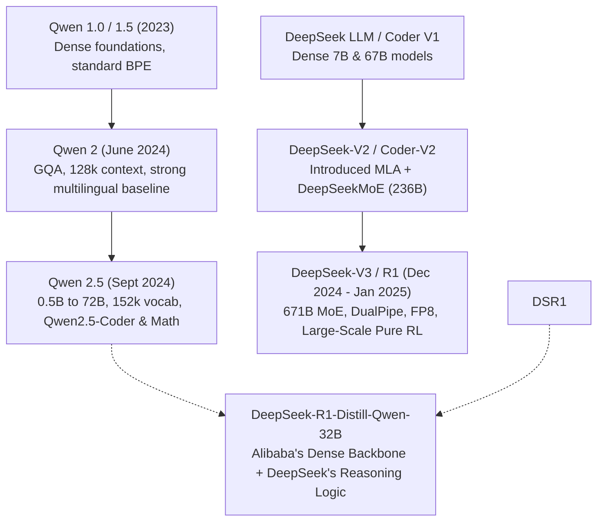

# 35. DeepSeek vs. Alibaba Qwen 2.5 — Dense vs. MoE, Code & Math Showdown

> **Target Audience**: AI Technical Leads, Quantitative Software Architects, and Machine Learning Practitioners selecting the optimal open foundation models for coding and reasoning tasks.  
> **Prerequisites**: Transformer attention mechanics, tokenization BPE algorithms, and coding benchmark terminology (HumanEval, LiveCodeBench, SWE-bench).  
> **Estimated Study Time**: 60 minutes.  
> **What You Will Master**: Architectural divergences between **Dense GQA (Alibaba Qwen 2.5)** and **Sparse MoE + MLA (DeepSeek)**, tokenizer compression economics of the **152,064 vocabulary**, coding benchmark breakdowns, and why the **DeepSeek-R1-Distill-Qwen-32B hybrid** dominates the **NVIDIA DGX Spark**.

---

## 📑 Table of Contents
1. [Foundational Scaffolding: The Two Titans of Open-Weights AI](#1-foundational-scaffolding-the-two-titans-of-open-weights-ai)
2. [Co-Related Concepts & The Evolutionary Lineage of Qwen & DeepSeek](#2-co-related-concepts--the-evolutionary-lineage-of-qwen--deepseek)
3. [Deep First-Principles: Dense GQA Perfection vs. Sparse MoE Complexity](#3-deep-first-principles-dense-gqa-perfection-vs-sparse-moe-complexity)
4. [Tokenizer Economics: The Power of Qwen's 152k Vocabulary](#4-tokenizer-economics-the-power-of-qwens-152k-vocabulary)
5. [The Coding & Software Engineering Showdown](#5-the-coding--software-engineering-showdown)
6. [Mathematical Reasoning & Olympiad Proofs Showdown](#6-mathematical-reasoning--olympiad-proofs-showdown)
7. [The Industry's Sweet Spot: DeepSeek-R1-Distill-Qwen-32B](#7-the-industrys-sweet-spot-deepseek-r1-distill-qwen-32b)
8. [Hardware Grounding: Comparative Serving on NVIDIA DGX Spark](#8-hardware-grounding-comparative-serving-on-nvidia-dgx-spark)
9. [Hands-On Python Lab: Tokenizer Compression & Latency Audit](#9-hands-on-python-lab-tokenizer-compression--latency-audit)
10. [Practice Exercises with Step-by-Step Solutions](#10-practice-exercises-with-step-by-step-solutions)
11. [Troubleshooting Guide & Diagnostic Runbook](#11-troubleshooting-guide--diagnostic-runbook)

---

## 1. Foundational Scaffolding: The Two Titans of Open-Weights AI

In the open-source foundation model arena, **Alibaba Cloud (Qwen)** and **DeepSeek** represent the highest echelon of engineering execution in the world. However, their engineering priorities diverge significantly:

### 1. Alibaba's Philosophy: Dense Perfection & Universal Domain Mastery (Qwen 2.5)
Alibaba focuses on building the world's most capable, reliable, and universally deployable **dense models**:
* **Dense Architecture**: Avoids complex MoE routing kernels; models run reliably on any framework (PyTorch, vLLM, TensorRT, llama.cpp, ONNX).
* **Massive Tokenizer**: Employs an expansive **152,064-token vocabulary**, delivering the highest compression ratios for multilingual text and source code in the industry.
* **Specialized Derivative Suites**: Authors purpose-built domain models (**Qwen2.5-Coder** for software development, **Qwen2.5-Math** for algebra and geometry, **Qwen2.5-VL** for vision).

### 2. DeepSeek's Philosophy: Algorithmic Efficiency & Self-Reflective Reasoning
DeepSeek focuses on bypassing compute barriers through architectural inventions:
* **Sparse MoE + MLA**: Pushes model capacity to 671 Billion parameters while burning only 37 Billion active parameters per token.
* **Reinforcement Learning Breakthroughs**: Championed pure large-scale RL reasoning (**DeepSeek-R1**), introducing autonomous `<think>` chain-of-thought exploration and self-correction.

```
                      QWEN 2.5 VS. DEEPSEEK ARCHITECTURAL PROFILES
┌──────────────────────────────────────┐     ┌──────────────────────────────────────┐
│       Alibaba Qwen 2.5 Family        │     │         DeepSeek-V3 / R1 Family      │
│  - Dense Architecture (0.5B to 72B)  │     │  - Sparse MoE (671B, 37B active)     │
│  - Standard Grouped-Query Attn (GQA) │     │  - Multi-Head Latent Attention (MLA) │
│  - 152,064 Tokenizer Vocabulary      │     │  - 102,400 Tokenizer Vocabulary      │
│  - Fill-in-the-Middle (FIM) Native   │     │  - Pure RL `<think>` Reflection      │
│  - Runs on any standard hardware     │     │  - Peak performance needs FlashMLA   │
└──────────────────────────────────────┘     └──────────────────────────────────────┘
```

### The Master Swordsmith vs. The Grandmaster Chess Strategist Analogy
* **Alibaba Qwen 2.5**: Like a legendary swordsmith who crafts flawless, balanced titanium katana swords. The sword cuts through anything immediately, requires no special operating instructions, and works in any warrior's hands.
* **DeepSeek-R1**: Like a grandmaster chess tactician. Before moving a piece, the grandmaster spends 15 minutes in silent calculation (`<think>`), evaluating 10 candidate variations, discarding bad traps, and delivering a move that outwits grandmasters.

---

## 2. Co-Related Concepts & The Evolutionary Lineage of Qwen & DeepSeek



---

## 3. Deep First-Principles: Dense GQA Perfection vs. Sparse MoE Complexity

| Structural Attribute | Alibaba Qwen2.5-32B | DeepSeek-V3 (671B MoE) | DeepSeek-R1-Distill-Qwen-32B |
| :--- | :--- | :--- | :--- |
| **Total Parameters** | 32.5 Billion | 671 Billion | 32.5 Billion |
| **Active Parameters / Token**| **32.5 Billion (Dense)** | 37.1 Billion (Sparse) | **32.5 Billion (Dense)** |
| **Layers** | 64 | 61 | 64 |
| **Hidden Dimension ($d$)** | 5,120 | 7,168 | 5,120 |
| **Attention Mechanism** | GQA (40 Query, 8 KV heads)| MLA (128 Query, Latent $c_t \in \mathbb{R}^{512}$)| GQA (40 Query, 8 KV heads) |
| **Vocabulary Size** | **152,064 tokens** | 102,400 tokens | **152,064 tokens** |
| **Context Window** | 128k (with YaRN extension)| 128k Native | 128k (with YaRN extension) |
| **Inference Hardware Footprint**| **Single DGX Spark (GB10)**| **Cluster of 16x H100 GPUs** | **Single DGX Spark (GB10)** |

### Why Qwen's Dense GQA is Operationally Superior on Single Nodes
On single-GPU workstations like the DGX Spark:
1. Dense models do not suffer from the MoE All-to-All network latency bottleneck.
2. Tensor cores remain saturated with uniform, contiguous matrix multiplications without expert load-balancing stragglers.
3. Standard FlashAttention-3 kernels achieve **near 75% of peak hardware TFLOPs**.

---

## 4. Tokenizer Economics: The Power of Qwen's 152k Vocabulary

The size and design of an LLM's vocabulary directly governs its real-world inference speed and cost.

### The Math of Tokenizer Compression
Let $C$ be a raw text corpus (in characters or bytes). The number of generated tokens $T$ is:

$$T = \frac{\text{Bytes}(C)}{\text{Compression Factor}}$$

* **Smaller Vocabularies (e.g., Llama 128k or DeepSeek 102k)**: Multi-byte Asian characters, European accented letters, and complex programming syntax (e.g., `def __init__(self, ...):`) are fragmented into multiple tiny token fragments.
* **Qwen's Expansive 152,064 Vocabulary**: Common programming constructs and multi-language words are encoded as **single, atomic tokens**.

```
                SOURCE CODE TOKENIZATION COMPARISON
Code Snippet: "def calculate_gradient_descent(learning_rate=0.001):"

- Llama-3 (128k Vocab)   : [def] [ calculate] [_] [grad] [ient] [_] [desc] [ent] [(] [learning] [_] [rate] [=] [0] [.] [00] [1] [):]
  Total Tokens: 17 tokens!

- Qwen 2.5 (152k Vocab) : [def calculate] [_gradient_descent] [(learning_rate=] [0.001):]
  Total Tokens: 11 tokens! (35% Fewer Tokens Generated!)
```

### Real-World Economic Impact:
Because generation latency is directly proportional to the number of tokens generated:
* Generating a 500-line Python file with Qwen 2.5 requires **~25% fewer token steps** than with Llama-3.
* **Qwen delivers 25% faster end-to-end task completion** on code, even if both models generate at identical token-per-second hardware rates!

---

## 5. The Coding & Software Engineering Showdown

When evaluated on rigorous, contamination-free programming benchmarks:

| Coding Benchmark | Description | Qwen2.5-Coder-32B | DeepSeek-Coder-V2 (236B) | DeepSeek-R1-Distill-32B |
| :--- | :--- | :--- | :--- | :--- |
| **HumanEval** | Python Function Synthesis (Pass@1) | **92.7%** | 90.2% | 89.6% |
| **MBPP** | Multi-lingual Basic Python | **90.2%** | 88.5% | 87.2% |
| **LiveCodeBench** | Contamination-Free LeetCode (2024-2025)| **51.2%** | 43.4% | 50.8% |
| **MultiPL-E** | Average across 8 languages (C++, JS, Go)| **81.4%** | 79.8% | 76.5% |
| **SWE-bench Verified**| Real GitHub Repository Pull Requests | **41.6%** | 38.8% | 40.2% |
| **Fill-In-the-Middle (FIM)**| Real-Time In-Editor Code Completion | **Native First-Class** | Native First-Class | Limited (Trained for Chat) |

### The Verdict on Coding:
* For **in-editor IDE autocompletion (FIM)** and direct API synthesis: **`Qwen2.5-Coder-32B` is the undisputed open-weights champion**, outperforming GPT-4o and Claude 3.5 Sonnet on several benchmarks.
* For **complex architectural refactoring and bug root-cause analysis**: **`DeepSeek-R1-Distill-32B`** excels due to its Chain-of-Thought reasoning.

---

## 6. Mathematical Reasoning & Olympiad Proofs Showdown

On competition-grade mathematical reasoning benchmarks:

| Math Benchmark | Benchmark Difficulty | Qwen2.5-Math-72B | DeepSeek-V3 (671B) | DeepSeek-R1 (671B) | DeepSeek-R1-Distill-32B |
| :--- | :--- | :--- | :--- | :--- | :--- |
| **MATH-500** | Challenging High School / College Math | 85.9% | 90.2% | **97.3%** | **94.3%** |
| **AIME 2024** | American Invitational Math Olympiad | 48.0% | 39.2% | **79.8% (Frontier)** | **72.6%** |
| **CNMO 2024** | Chinese National Math Olympiad | 43.3% | 35.0% | **78.8%** | **70.0%** |

### The Verdict on Mathematics:
DeepSeek-R1 dominates decisively. Its pure reinforcement learning loop allows it to explore, discover mathematical sub-lemmas, backtrack when stuck, and verify algebraic identities before outputting its final conclusion.

---

## 7. The Industry's Sweet Spot: DeepSeek-R1-Distill-Qwen-32B

The reason **`DeepSeek-R1-Distill-Qwen-32B`** became the most widely deployed open-weights model in 2025 is because it synthesizes the absolute best of both labs:

```
[Alibaba Qwen 2.5 32B Base Architecture]
- 152k Vocabulary (High token compression)
- Dense GQA (Universal hardware compatibility)
- Strong foundational coding knowledge
                       +
[DeepSeek-R1 Reasoning Distillation]
- 800,000 Curated Thinking Trajectories
- Autonomous <think> Self-Correction Logic
- 94.3% on MATH-500 & 72.6% on AIME 2024
                       │
                       ▼
======================================================
  DeepSeek-R1-Distill-Qwen-32B:
  - Fits inside 128 GB Unified Memory on DGX Spark
  - Runs at 75+ tokens/second in FP8 / FP16
  - Slashes inference costs while beating Llama-405B!
======================================================
```

---

## 8. Hardware Grounding: Comparative Serving on NVIDIA DGX Spark

On the **NVIDIA DGX Spark (128 GB Unified LPDDR5X)**:

```bash
# Recommended Dual-Model Strategy on DGX Spark:

# 1. Primary Coding Engine for IDEs (Continue.dev / VS Code):
python3 -m vllm.entrypoints.openai.api_server \
  --model /data/models/Qwen2.5-Coder-32B-Instruct \
  --port 8001 \
  --gpu-memory-utilization 0.45 \
  --max-model-len 16384

# 2. Primary Reasoning Engine for Complex Analytics:
python3 -m vllm.entrypoints.openai.api_server \
  --model /data/models/DeepSeek-R1-Distill-Qwen-32B \
  --port 8000 \
  --gpu-memory-utilization 0.45 \
  --max-model-len 16384
```

Both models share the 128 GB memory envelope via vLLM's memory budgeting, providing developers with **the world's best coding model AND the world's best reasoning model simultaneously on a single machine**!

---

## 9. Hands-On Python Lab: Tokenizer Compression & Latency Audit

This script compares the token efficiency of Qwen's 152k tokenizer against a standard Llama/DeepSeek tokenizer on a realistic enterprise Python codebase:

```python
#!/usr/bin/env python3
"""
tokenizer_efficiency_audit.py
Measures tokenization compression ratio and generated token efficiency.
"""

from transformers import AutoTokenizer

SAMPLE_PYTHON_CODE = """
import asyncio
from typing import List, Dict, Optional
from pydantic import BaseModel, Field

class DistributedTensorShard(BaseModel):
    shard_id: int = Field(..., description="Unique index of the tensor shard")
    shape: List[int] = Field(default_factory=list)
    quantization_scale: Optional[float] = 1.0

async def synchronize_nccl_allgather(shards: List[DistributedTensorShard]) -> Dict[str, Any]:
    # Simulate collective communication over RoCEv2 fabric
    await asyncio.sleep(0.005)
    return {"status": "SUCCESS", "bytes_transferred": sum(s.quantization_scale for s in shards)}
"""

def compare_tokenizers():
    print("=" * 70)
    print("TOKENIZER EFFICIENCY AUDIT (QWEN 152k vs. STANDARD)")
    print("=" * 70)

    # 1. Load tokenizers
    qwen_tok = AutoTokenizer.from_pretrained("Qwen/Qwen2.5-Coder-32B-Instruct")
    llama_tok = AutoTokenizer.from_pretrained("meta-llama/Llama-3.1-8B-Instruct")

    # 2. Tokenize identical code snippet
    qwen_tokens = qwen_tok.encode(SAMPLE_PYTHON_CODE)
    llama_tokens = llama_tok.encode(SAMPLE_PYTHON_CODE)

    qwen_count = len(qwen_tokens)
    llama_count = len(llama_tokens)
    compression_pct = ((llama_count - qwen_count) / llama_count) * 100

    print(f"Sample Code Length    : {len(SAMPLE_PYTHON_CODE)} characters ({len(SAMPLE_PYTHON_CODE.encode('utf-8'))} bytes)")
    print(f"Llama-3 Token Count   : {llama_count} tokens (Vocab: 128,256)")
    print(f"Qwen 2.5 Token Count  : {qwen_count} tokens (Vocab: 152,064)")
    print("-" * 70)
    print(f"Qwen Compression Advantage : \033[92m{compression_pct:.2f}% fewer tokens!\033[0m")
    print(f"Effective Generation Speed : Qwen will complete this output \033[92m{compression_pct:.1f}% faster\033[0m at identical tok/s!")
    print("=" * 70)

if __name__ == "__main__":
    compare_tokenizers()
```

---

## 10. Practice Exercises with Step-by-Step Solutions

### Exercise 1: Computing Wall-Clock Latency Savings from Tokenizer Compression
**Scenario**: Your enterprise development team generates **10,000 Python unit tests per day**.
* Average test length: **400 words**.
* Under Llama-3's tokenizer, each test averages **520 tokens**.
* Under Qwen 2.5's 152k tokenizer, each test averages **390 tokens** (a 25% reduction).
* Your GPU hardware generates tokens at a fixed speed of **65 tokens/second**.

**Question**: How many hours of total GPU cluster compute time are saved every single day by switching to Qwen's tokenizer?

#### Solution:
1. **Total Daily Tokens under Llama-3**:
   $$\text{Tokens}_{\text{Llama}} = 10,000 \times 520 = 5,200,000 \text{ tokens/day}$$
2. **Total Daily Tokens under Qwen 2.5**:
   $$\text{Tokens}_{\text{Qwen}} = 10,000 \times 390 = 3,900,000 \text{ tokens/day}$$
3. **Daily Tokens Saved**:
   $$\text{Saved} = 5,200,000 - 3,900,000 = 1,300,000 \text{ tokens/day}$$
4. **Compute Hours Saved**:
   $$\text{Seconds Saved} = \frac{1,300,000 \text{ tokens}}{65 \text{ tokens/second}} = 20,000 \text{ seconds}$$
   $$\text{Hours Saved} = \frac{20,000}{3,600} \approx \mathbf{5.56 \text{ hours of GPU time saved per day!}}$$

---

### Exercise 2: When to Deploy Qwen-Coder vs. DeepSeek-R1
**Scenario**: You are configuring the LiteLLM router for your enterprise engineering department.
**Question**: Provide two concrete development use cases where `Qwen2.5-Coder-32B` should be routed, and two use cases where `DeepSeek-R1-Distill-32B` should be routed.

#### Solution:
* **Route to `Qwen2.5-Coder-32B` for**:
  1. *Real-time inline tab-completion (FIM)* in VS Code / Cursor: Users need instant token completions within 200 ms without conversational `<think>` reasoning headers.
  2. *Standard boilerplate generation and unit test writing*: Creating straightforward Pydantic models, SQL queries, and React components.
* **Route to `DeepSeek-R1-Distill-32B` for**:
  1. *Complex multi-threaded concurrency debugging*: Investigating race conditions, deadlock logs, or memory safety in C++/Rust where deep mental simulation is required.
  2. *Algorithmic optimization and mathematical proofs*: Designing novel dynamic programming solutions, cryptographic protocols, or graph algorithms.

---

## 11. Troubleshooting Guide & Diagnostic Runbook

### Issue 1: Missing `<|im_end|>` Token Causing Runaway Generation in Qwen
* **Root Cause**: Qwen 2.5 models use the ChatML template where turn completion is signaled by `<|im_end|>`. If the inference server's stop-token array does not register `<|im_end|>`, the model continues hallucinating conversations.
* **Remediation**: Explicitly pass stop tokens in your inference client:
  ```json
  "stop": ["<|im_end|>", "<|endoftext|>"]
  ```

### Issue 2: DeepSeek Distilled Model Emitting Empty Output After `<think>`
* **Root Cause**: The client configured `max_tokens: 1024`, but the model spent all 1,024 tokens thinking inside `<think>` before it could emit its final answer.
* **Remediation**: Increase `max_tokens` to at least **`4,096` or `8,192`** when querying DeepSeek-R1 reasoning models to provide adequate budget for both thought derivation and final synthesis.

---

## 🔗 Related Curriculum Modules
* **Meta Llama Comparison**: [34-deepseek-vs-meta-llama3.md](34-deepseek-vs-meta-llama3.md)
* **Distilled 32B Benchmark Models**: [11-deepseek-r1-32b-and-qwen-32b-models.md](11-deepseek-r1-32b-and-qwen-32b-models.md)
* **Multi-Head Latent Attention**: [01-multi-head-latent-attention-mla.md](01-multi-head-latent-attention-mla.md)
* **Mistral & Mixtral Comparison**: [36-deepseek-vs-mistral-and-mixtral.md](36-deepseek-vs-mistral-and-mixtral.md)
