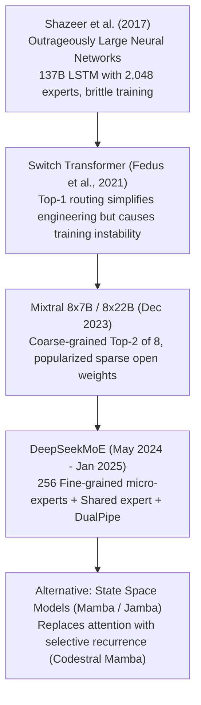

# 36. DeepSeek vs. Mistral & Mixtral — The Evolution of Mixture-of-Experts

> **Target Audience**: AI Systems Architects, Quantitative Researchers, and Platform Engineers analyzing the generational shift in sparse Mixture-of-Experts (MoE) architectures.  
> **Prerequisites**: MoE routing fundamentals (from [02-deepseek-moe-fine-grained-routing.md](02-deepseek-moe-fine-grained-routing.md)), Multi-Head Latent Attention (from [01-multi-head-latent-attention-mla.md](01-multi-head-latent-attention-mla.md)), and GPU memory bandwidth concepts.  
> **Estimated Study Time**: 55 minutes.  
> **What You Will Master**: The architectural leap from **Gen-1 Coarse-Grained MoE (Mixtral 8x7B)** to **Gen-2 Fine-Grained MoE (DeepSeekMoE)**, mathematical combinatorial expressiveness ($4.37 \times 10^{11}$ combinations), auxiliary-loss-free dynamic routing, state-space models (Codestral Mamba), and deployment sizing on the **NVIDIA DGX Spark**.

---

## 📑 Table of Contents
1. [Foundational Scaffolding: The MoE Generational Divide](#1-foundational-scaffolding-the-moe-generational-divide)
2. [Co-Related Concepts & The Evolution of Sparse Architectures](#2-co-related-concepts--the-evolution-of-sparse-architectures)
3. [Deep First-Principles: Coarse-Grained (Mixtral) vs. Fine-Grained (DeepSeekMoE)](#3-deep-first-principles-coarse-grained-mixtral-vs-fine-grained-deepseekmoe)
4. [Combinatorial Expressiveness Mathematics: $\binom{8}{2}$ vs. $\binom{256}{8}$](#4-combinatorial-expressiveness-mathematics-binom82-vs-binom2568)
5. [The Auxiliary-Loss Dilemma & Dynamic Bias Routing](#5-the-auxiliary-loss-dilemma--dynamic-bias-routing)
6. [Codestral & State-Space Models (Mamba) vs. Transformer MLA](#6-codestral--state-space-models-mamba-vs-transformer-mla)
7. [Licensing, Sovereignty & Compliance: Apache-2.0 vs. MNCL vs. MIT](#7-licensing-sovereignty--compliance-apache-20-vs-mncl-vs-mit)
8. [Comprehensive Benchmark Showdown: Mixtral 8x22B vs. DeepSeek-V3](#8-comprehensive-benchmark-showdown-mixtral-8x22b-vs-deepseek-v3)
9. [Hands-On Python Lab: Simulating Combinatorial Routing Expressiveness](#9-hands-on-python-lab-simulating-combinatorial-routing-expressiveness)
10. [Hardware Grounding: Serving Sizing on NVIDIA DGX Spark](#10-hardware-grounding-serving-sizing-on-nvidia-dgx-spark)
11. [Practice Exercises with Step-by-Step Solutions](#11-practice-exercises-with-step-by-step-solutions)
12. [Troubleshooting Guide & Diagnostic Runbook](#12-troubleshooting-guide--diagnostic-runbook)

---

## 1. Foundational Scaffolding: The MoE Generational Divide

In late 2023, **Mistral AI** (France) ignited the open-weights Mixture-of-Experts revolution with **Mixtral 8x7B**. By pairing 8 coarse-grained feed-forward blocks and activating only 2 per token, Mixtral delivered Llama-1 70B performance at the inference speed of a 13B model.

However, Mixtral represented **Generation 1 MoE**:
* **Coarse-Grained Experts**: Each expert was a giant, monolithic 7-billion parameter FFN network.
* **Limited Routing Combinations**: Routing each token to only 2 of 8 experts provided very few combinatorial pathways.
* **Knowledge Redundancy**: Common linguistic constructs (articles like *"the"*, punctuation, basic syntax) were redundantly memorized across all 8 experts, squandering parameter capacity.
* **Auxiliary Loss Penalty**: To prevent the router from collapsing onto 1 popular expert, Mixtral applied an artificial mathematical loss penalty that directly degraded language modeling capability.

One year later, **DeepSeek** introduced **Generation 2 MoE (DeepSeekMoE)**:
* **Fine-Grained Micro-Experts**: Sliced experts into 256 micro-networks ($1/4$ size each).
* **Dedicated Shared Experts**: Dedicated 1 permanent expert to handle universal grammar and syntax, freeing routed experts to hyper-specialize.
* **Auxiliary-Loss-Free Dynamic Balancing**: Replaced the degrading auxiliary loss with dynamic routing bias offsets.

```
                      GENERATION 1 VS. GENERATION 2 MoE
┌──────────────────────────────────────┐     ┌──────────────────────────────────────┐
│       Gen 1: Mixtral 8x7B (Coarse)   │     │      Gen 2: DeepSeekMoE (Fine)       │
│  - 8 Total Monolithic Experts        │     │  - 256 Total Micro-Experts           │
│  - Top-2 Routing                     │     │  - Top-8 Routing + 1 Shared Expert   │
│  - 28 Combinatorial Combinations     │     │  - 437 Billion Combinations!         │
│  - Heavy Knowledge Redundancy        │     │  - Zero Shared Redundancy            │
│  - Degrative Auxiliary Loss          │     │  - Auxiliary-Loss-Free Dynamic Bias  │
└──────────────────────────────────────┘     └──────────────────────────────────────┘
```

### The General Hospital Triage Analogy
* **Mixtral (Gen 1)**: Like a hospital divided into only 8 massive, general departments (Surgery, Internal Medicine, Pediatrics, etc.). When a patient arrives, the front desk sends them to two large wings. Because the wings are so broad, each wing must redundantly staff general triage nurses, pharmacy counters, and administrative desks.
* **DeepSeekMoE (Gen 2)**: Like a modern university medical center with a dedicated **Central Triage Desk (Shared Expert)** that checks vitals for 100% of patients, plus **256 hyper-specialized clinics (Micro-Experts)** (Pediatric Neuro-Oncologist, Cardiac Electrophysiologist, etc.). The patient sees the triage desk plus the exact 8 specialists tailored to their unique symptoms.

---

## 2. Co-Related Concepts & The Evolution of Sparse Architectures



---

## 3. Deep First-Principles: Coarse-Grained (Mixtral) vs. Fine-Grained (DeepSeekMoE)

### Expert Sizing & Routing Granularity
In a standard transformer layer with hidden dimension $d$ and intermediate FFN dimension $d_{ffn}$:

1. **Mixtral 8x7B**:
   * Total Experts $N = 8$.
   * Each expert intermediate dimension: $d_{\text{expert}} = d_{ffn} = 14,336$.
   * Activated per token: $k = 2$.
   * Active intermediate dimension: $2 \times 14,336 = 28,672$.
2. **DeepSeek-V3**:
   * Total Routed Experts $N = 256$, plus 1 Shared Expert.
   * Each routed expert intermediate dimension: $d_{\text{expert}} = \frac{d_{ffn}}{4} = 2,048$.
   * Activated per token: $k = 8$ routed $+ 1$ shared expert.
   * Active intermediate dimension: $(8 + 1) \times 2,048 = 18,432$.

By dividing FFN parameters into **smaller, granular chunks**, DeepSeek allows individual experts to focus on specialized linguistic, mathematical, or coding nuances without carrying redundant general knowledge!

---

## 4. Combinatorial Expressiveness Mathematics: $\binom{8}{2}$ vs. $\binom{256}{8}$

The expressive capability of an MoE network depends on the number of distinct subnetworks that can be dynamically assembled to process an input token:

$$\text{Combinatorial Pathways } \mathcal{C} = \binom{N}{k} = \frac{N!}{k! (N - k)!}$$

### 1. Mixtral 8x7B Expressive Pathways ($N = 8, k = 2$):
$$\mathcal{C}_{\text{Mixtral}} = \binom{8}{2} = \frac{8 \times 7}{2 \times 1} = \mathbf{28 \text{ possible combinations}}$$

Only **28 unique expert combinations** exist across the entire model. Two completely different concepts (e.g., French grammar and Python async programming) frequently collide into the exact same pair of experts!

### 2. DeepSeekMoE Expressive Pathways ($N = 256, k = 8$):
$$\mathcal{C}_{\text{DeepSeek}} = \binom{256}{8} = \frac{256!}{8! \times 248!} = \mathbf{437,395,199,440 \approx 4.37 \times 10^{11} \text{ combinations!}}$$

$$\text{Combinatorial Expressiveness Ratio} = \frac{4.37 \times 10^{11}}{28} \approx \mathbf{15.6 \times 10^9 \text{ (15.6 Billion Times Higher!)}}$$

DeepSeekMoE provides **over 15 Billion times more routing combinations** for the exact same active parameter budget, completely eliminating expert collision!

---

## 5. The Auxiliary-Loss Dilemma & Dynamic Bias Routing

### Why Traditional Auxiliary Loss Harms Quality
In Mixtral, an auxiliary load-balancing loss $\mathcal{L}_{\text{aux}}$ is added to the training objective:
$$\mathcal{L}_{\text{total}} = \mathcal{L}_{\text{LM}} + \alpha \cdot \mathcal{L}_{\text{aux}}$$
If expert 3 receives more tokens than expert 4, $\mathcal{L}_{\text{aux}}$ penalizes the router.
* **The Flaw**: It forces the model to route tokens to sub-optimal experts purely for the sake of artificial hardware balancing, directly degrading language modeling accuracy.

### DeepSeek's Breakthrough: Dynamic Routing Bias ($b_i$)
DeepSeek completely sets $\alpha = 0$, eliminating auxiliary loss from gradient descent. Instead, it adjusts router selection using **post-hoc dynamic bias offsets**:

$$s_{i,t} = \text{TopK} \left( \frac{\exp(u_{i,t} + b_i)}{\sum_j \exp(u_{j,t} + b_j)}, k \right)$$

* At the end of each training step, the orchestrator monitors expert queue loads.
* If Expert $i$ is overloaded, its bias $b_i$ is decremented: $b_i \leftarrow b_i - \gamma$.
* If Expert $i$ is starved, its bias $b_i$ is incremented: $b_i \leftarrow b_i + \gamma$.
* **Result**: Perfect hardware load-balancing across GPU clusters with **zero penalty applied to language modeling gradients**!

---

## 6. Codestral & State-Space Models (Mamba) vs. Transformer MLA

Mistral also pioneered non-Transformer architectures with **Codestral Mamba (7B)**:

```
┌──────────────────────────────────────┐     ┌──────────────────────────────────────┐
│       Codestral Mamba (Mamba2)       │     │     DeepSeek-Coder-V2 (Transformer)  │
│  - Linear Time Complexity O(N)       │     │  - Quadratic / Latent Attention      │
│  - Constant KV Memory O(1)           │     │  - MLA Latent KV Cache Compression   │
│  - Infinite Context Streaming        │     │  - 128k Native Context               │
│  - Weaker Multi-Hop Induction        │     │  - Unmatched Symbolic Reasoning      │
└──────────────────────────────────────┘     └──────────────────────────────────────┘
```

* **Codestral Mamba**: Ideal for infinite streaming log analysis and continuous telemetry where memory must remain strictly constant ($O(1)$).
* **DeepSeek MLA**: Preserves the complete associative retrieval power of self-attention while using low-rank latent compression to slash KV cache memory by 93%.

---

## 7. Licensing, Sovereignty & Compliance: Apache-2.0 vs. MNCL vs. MIT

| Dimension | Mistral AI (France / EU) | DeepSeek (China) |
| :--- | :--- | :--- |
| **Open Source Licensing** | Split: Apache-2.0 (Base) vs. **MNCL (Restricted)** | **Permissive MIT / DeepSeek Open License** |
| **Commercial Exploitation** | Restrictive on Mistral Large 2 & Codestral | **100% Unrestricted Commercial Deployment** |
| **Model Distillation Rights**| **Strictly Prohibited under MNCL** | **Explicitly Permitted (Encouraged!)** |
| **Regulatory Alignment** | Native EU AI Act Compliance & GDPR Focus | Chinese Cybersecurity Standards (CAC) |
| **Weights Availability** | Hugging Face / Mistral Cloud | Hugging Face / Direct BitTorrent |

* **Warning on MNCL**: Mistral Large 2 and Codestral 22B cannot be commercially deployed or distilled without purchasing a commercial license from Mistral AI.
* **DeepSeek Freedom**: DeepSeek explicitly allows distillation into smaller models (as proven by DeepSeek-R1-Distill-Qwen).

---

## 8. Comprehensive Benchmark Showdown: Mixtral 8x22B vs. DeepSeek-V3

| Benchmark Metric | Mixtral 8x7B (Gen 1) | Mixtral 8x22B (Gen 1) | Mistral Large 2 (Dense) | DeepSeek-V3 (Gen 2 MoE) |
| :--- | :--- | :--- | :--- | :--- |
| **Total Parameters** | 46.7 Billion | 141 Billion | 123 Billion (Dense) | **671 Billion** |
| **Active Params / Token** | **12.9 Billion** | 39 Billion | 123 Billion | **37.1 Billion** |
| **Context Window** | 32k tokens | 64k tokens | 128k tokens | **128k tokens** |
| **Attention Architecture**| GQA | GQA | GQA | **MLA (93% KV Savings)**|
| **MMLU (Knowledge)** | 70.6% | 77.8% | 84.0% | **88.5% (+10.7% over 8x22B!)**|
| **MATH-500** | 28.4% | 41.8% | 66.8% | **90.2% (More than 2x higher!)**|
| **HumanEval (Python)** | 68.4% | 75.0% | 82.0% | **82.6%** |
| **GSM8K (Math Word Problems)**| 58.4% | 78.4% | 88.0% | **89.3%** |

---

## 9. Hands-On Python Lab: Simulating Combinatorial Routing Expressiveness

This script calculates the exact mathematical combinations, active parameter ratios, and routing entropy differences between Mixtral (Top-2 of 8) and DeepSeekMoE (Top-8 of 256):

```python
#!/usr/bin/env python3
"""
moe_combinatorial_audit.py
Mathematical comparison of routing expressiveness between Gen-1 and Gen-2 MoE architectures.
"""

import math

def analyze_moe_architecture(name: str, num_experts: int, top_k: int, expert_param_b: float, shared_experts: int = 0):
    combinations = math.comb(num_experts, top_k)
    active_params = (top_k * expert_param_b) + (shared_experts * expert_param_b)
    total_params = (num_experts * expert_param_b) + (shared_experts * expert_param_b)
    sparsity_ratio = (active_params / total_params) * 100

    print("=" * 65)
    print(f"ARCHITECTURE ANALYSIS: {name}")
    print("=" * 65)
    print(f"Total Experts Available  : {num_experts} (+ {shared_experts} Shared)")
    print(f"Experts Activated/Token  : Top-{top_k}")
    print(f"Total Model Parameter FFN: {total_params:.1f} Billion")
    print(f"Active Parameters/Token  : {active_params:.1f} Billion")
    print(f"Activation Sparsity      : {sparsity_ratio:.2f}% active")
    print(f"Combinatorial Pathways   : {combinations:,} unique combinations")
    print("=" * 65 + "\n")
    return combinations

if __name__ == "__main__":
    c_mixtral = analyze_moe_architecture(
        name="Mixtral 8x7B (Gen 1 MoE)",
        num_experts=8,
        top_k=2,
        expert_param_b=5.8,
        shared_experts=0
    )

    c_deepseek = analyze_moe_architecture(
        name="DeepSeekMoE V3 (Gen 2 Fine-Grained MoE)",
        num_experts=256,
        top_k=8,
        expert_param_b=2.5,
        shared_experts=1
    )

    advantage = c_deepseek / c_mixtral
    print(f"DeepSeekMoE Combinatorial Advantage: \033[92m{advantage:,.0f}x more expressive pathways!\033[0m")
```

---

## 10. Hardware Grounding: Serving Sizing on NVIDIA DGX Spark

The **NVIDIA DGX Spark** features **128 GB Unified Memory**:

| Model Candidate | Format | Memory Footprint | Tokens / Sec | Feasibility on Single DGX Spark |
| :--- | :--- | :--- | :--- | :--- |
| **Mixtral 8x7B** | FP8 | ~26 GiB | 85 tok/s | **Supported** (Fast daily conversational workhorse) |
| **Mixtral 8x22B** | FP8 | ~80 GiB | 32 tok/s | **Marginal** (Constrained KV cache headroom) |
| **Mistral Large 2 (123B)** | FP8 | ~126 GiB | < 5 tok/s | **OOM** (Exceeds unified memory when KV added) |
| **DeepSeek-R1-Distill-32B** | **FP8 / FP16** | **~32 GiB** | **75 tok/s** | **OPTIMAL (Beats Mixtral 8x22B on all math/coding)** |

---

## 11. Practice Exercises with Step-by-Step Solutions

### Exercise 1: Calculating KV Cache Memory at 64k Context
**Scenario**: Compare the memory required per user session at **64,000 tokens** context length between:
1. **Mixtral 8x22B (GQA)**: $L = 56$, $n_{kv} = 8$, $d_k = 128$, FP16 precision ($2 \text{ bytes}$).
2. **DeepSeek-V3 (MLA)**: Latent dimension $d_c + d_R = 576$, $L = 61$, FP8 precision ($1 \text{ byte}$).

#### Solution:
1. **Mixtral 8x22B GQA**:
   $$\text{Bytes/tok} = 2 \times 56 \times 8 \times 128 \times 2 = 229,376 \text{ Bytes} \approx 224 \text{ KiB/tok}$$
   $$\text{Total Memory at 64k} = 64,000 \times 229,376 \text{ Bytes} \approx \mathbf{14.68 \text{ Gigabytes per user!}}$$
2. **DeepSeek-V3 MLA**:
   $$\text{Bytes/tok} = 576 \times 61 \times 1 = 35,136 \text{ Bytes} \approx 34.3 \text{ KiB/tok}$$
   $$\text{Total Memory at 64k} = 64,000 \times 35,136 \text{ Bytes} \approx \mathbf{2.25 \text{ Gigabytes per user!}}$$
*Result*: DeepSeek MLA consumes **6.5x less memory**, allowing a single DGX Spark node to serve 6.5x more concurrent users!

---

### Exercise 2: Why Did Mistral Shift to Dense for Mistral Large 2?
**Scenario**: In mid-2024, Mistral AI released their flagship model **Mistral Large 2 (123B parameters)** as a **dense model**, abandoning the MoE architecture used in Mixtral 8x22B.
**Question**: Analyze why a frontier lab would choose a 123B dense architecture over an MoE architecture for enterprise deployment.

#### Solution:
* **Inference Hardware Sizing**: A 123B dense model fits onto a single standard node of $8\times \text{H100 SXM5}$ GPUs with high Tensor Core arithmetic utilization ($> 65\%$).
* **Elimination of All-to-All Bottlenecks**: Gen-1 MoE models across multi-node clusters suffer from network latency during cross-node expert dispatch. Dense models rely solely on intra-node NVLink `All-Reduce`, delivering more predictable latency.
* **Simplicity**: Dense models can be deployed on standard inference runtimes without specialized grouped GEMM kernels or expert load-balancers.

---

## 12. Troubleshooting Guide & Diagnostic Runbook

### Issue 1: `RuntimeError: CUDA error: invalid configuration argument` When Loading Mixtral in vLLM
* **Root Cause**: Tensor Parallelism (`--tensor-parallel-size`) was set to a value that does not evenly divide the 8 experts (e.g., $TP = 3$ or $TP = 6$).
* **Remediation**: Configure $TP$ to a power-of-two that divides 8 cleanly ($TP = 1, 2, 4, \text{ or } 8$).

### Issue 2: Severe Token Generation Jitter on Mixtral 8x7B
* **Root Cause**: Uneven token routing caused Expert 0 and Expert 1 to receive 80% of all tokens, while other experts sat idle.
* **Remediation**: Update vLLM to enable fused MoE kernels with dynamic load-balancing buffers:
  ```bash
  python3 -m vllm.entrypoints.openai.api_server --model mistralai/Mixtral-8x7B-Instruct-v0.1 --enforce-eager
  ```

---

## 🔗 Related Curriculum Modules
* **MoE Fine-Grained Foundations**: [02-deepseek-moe-fine-grained-routing.md](02-deepseek-moe-fine-grained-routing.md)
* **Meta Llama Comparison**: [34-deepseek-vs-meta-llama3.md](34-deepseek-vs-meta-llama3.md)
* **Alibaba Qwen Comparison**: [35-deepseek-vs-alibaba-qwen25.md](35-deepseek-vs-alibaba-qwen25.md)
* **OpenAI o1 & Claude Showdown**: [37-deepseek-vs-openai-o1-and-claude.md](37-deepseek-vs-openai-o1-and-claude.md)
