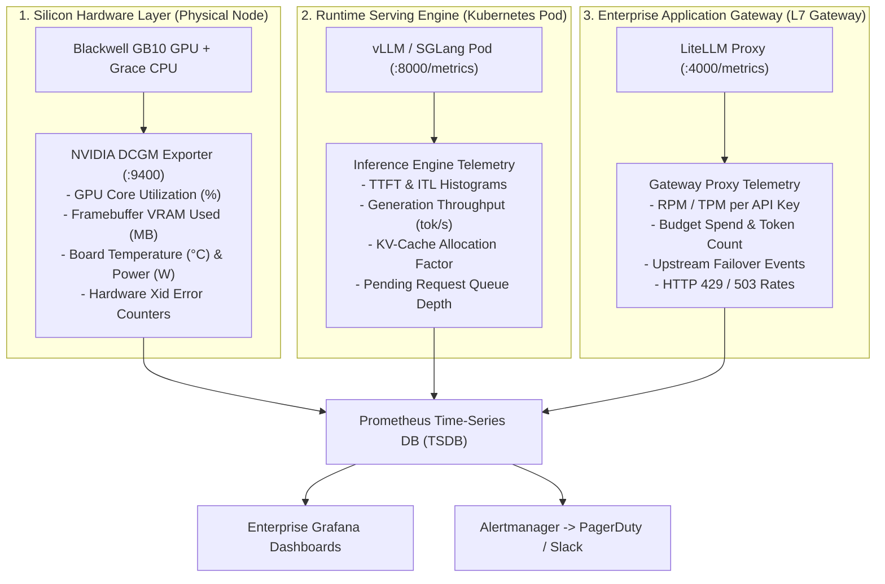

# 38. DCGM, Prometheus & Grafana Telemetry — Full-Stack AI Metrics & Observability

> **Target Audience**: AI Site Reliability Engineers (SREs), MLOps Architects, Kubernetes Cluster Operators, and Infrastructure Engineers responsible for production GPU telemetry and SLA guarantees.  
> **Prerequisites**: Working knowledge of Prometheus metrics formats, Kubernetes DaemonSets/Services, and vLLM inference engine architecture ([Volume 15](15-vllm-serving-deepseek-and-qwen.md), [Volume 19](19-kubernetes-manifests-for-deepseek.md)).  
> **Estimated Deep-Dive Time**: 45 minutes  
> **What You Will Master**:
> 1. The 3-Tier Observability Architecture: Silicon Hardware (NVIDIA DCGM), Inference Runtime Engine (vLLM/SGLang), and Application Gateway (LiteLLM).
> 2. Key NVIDIA DCGM Field Identifiers (FIDs) for GPU core utilization, unified memory allocation, power limits, and hardware Xid error monitoring.
> 3. Production PromQL queries for critical LLM Service Level Indicators (SLIs): Time to First Token (TTFT), Inter-Token Latency (ITL), and KV-cache saturation.
> 4. Production Kubernetes manifests: DCGM Exporter DaemonSet, Prometheus Scrape Configs, and Alertmanager Alerting Rules.
> 5. A self-contained Python multi-tier Prometheus metric simulator with real-time scraping and PromQL math.
> 6. Hardware-specific monitoring considerations for the NVIDIA DGX Spark (Grace Blackwell GB10 NVLink-C2C interconnect and unified LPDDR5X memory).

---

## 📑 Table of Contents
1. [Zero-to-One Intuition: Why Standard APM Fails for AI Inference](#1-zero-to-one-intuition-why-standard-apm-fails-for-ai-inference)
2. [The 3-Tier AI Observability Architecture](#2-the-3-tier-ai-observability-architecture)
3. [Silicon Layer: NVIDIA DCGM Architecture & Field Identifiers](#3-silicon-layer-nvidia-dcgm-architecture--field-identifiers)
4. [Engine Layer: vLLM & SGLang Inference Metrics](#4-engine-layer-vllm--sglang-inference-metrics)
5. [Gateway Layer: LiteLLM Traffic & Error Telemetry](#5-gateway-layer-litellm-traffic--error-telemetry)
6. [Production Kubernetes Configurations & Prometheus Scrapes](#6-production-kubernetes-configurations--prometheus-scrapes)
7. [Production Alertmanager Rules & PromQL SLA Formulas](#7-production-alertmanager-rules--promql-sla-formulas)
8. [Hands-On Production Lab: End-to-End AI Telemetry Simulator](#8-hands-on-production-lab-end-to-end-ai-telemetry-simulator)
9. [Hardware Grounding for NVIDIA DGX Spark (Grace Blackwell GB10)](#9-hardware-grounding-for-nvidia-dgx-spark-grace-blackwell-gb10)
10. [Step-by-Step Practice Exercises with Full Solutions](#10-step-by-step-practice-exercises-with-full-solutions)
11. [Troubleshooting & Operational FAQ](#11-troubleshooting--operational-faq)

---

## 1. Zero-to-One Intuition: Why Standard APM Fails for AI Inference

In traditional microservices (e.g., REST APIs, databases), system health is monitored via standard metrics: **CPU utilization**, **host RAM usage**, **HTTP request rate**, and **P99 latency**. 

If you apply these traditional metrics to an LLM serving cluster on NVIDIA DGX Spark, your monitoring will mislead you:

```text
Traditional Microservice Mental Model (Fails for AI):
- CPU at 95% = Overloaded (Scale Out!)
- RAM at 90% = Memory Leak Detected!
- P99 HTTP Latency at 8 seconds = Massive System Failure!

AI Inference Reality (NVIDIA DGX Spark / vLLM):
- GPU VRAM at 90% = NORMAL! (vLLM pre-allocates 90% of memory for KV-cache on boot).
- CPU at 5% = NORMAL! (Inference compute runs on Blackwell Tensor Cores, not the host CPU).
- P99 HTTP Latency at 45 seconds = NORMAL! (Model generated 2,000 reasoning tokens over SSE).
```

### The Invisible Bottlenecks of LLM Serving
Without dedicated AI telemetry, an engineering team is blind to the actual failure modes of foundation models:
1. **KV-Cache Fragmentation & Starvation**: If GPU memory cache factor hits 100%, vLLM stops admitting requests. Requests queue silently in memory, TTFT skyrockets from 80ms to 25 seconds, and standard HTTP health checks still report `200 OK`.
2. **Thermal & Power Throttling**: If ambient data center temperature rises, the GPU silently dials down clock frequencies from 2.1 GHz to 900 MHz. The service doesn't crash, but generation throughput drops by 60%.
3. **Hardware Xid Errors**: Silicon memory faults or NVLink-C2C bus dropouts occur at the driver layer without generating application-level stack traces.

---

## 2. The 3-Tier AI Observability Architecture

To achieve full-stack observability, metrics must be captured across three coordinated layers:



---

## 3. Silicon Layer: NVIDIA DCGM Architecture & Field Identifiers

The **NVIDIA Data Center GPU Manager (DCGM)** is a low-overhead profiling and telemetry suite built directly into the NVIDIA driver stack. The `dcgm-exporter` queries the NVIDIA driver via the NVML (NVIDIA Management Library) API and publishes standard Prometheus metrics over port 9400.

```
+-----------------------------------------------------------------------------------------------+
|                                DCGM ARCHITECTURE & METRIC FLOW                                 |
+-----------------------------------------------------------------------------------------------+
|  Blackwell GB10 Silicon Counters (Hardware Clocks, Sensors, NVLink Registers)                  |
|                                       │                                                       |
|                                       ▼                                                       |
|  NVIDIA Kernel Driver (nvidia.ko) & NVML API (libnvidia-ml.so)                                |
|                                       │                                                       |
|                                       ▼                                                       |
|  NVIDIA DCGM Daemon (nv-hostengine)                                                           |
|                                       │                                                       |
|                                       ▼                                                       |
|  dcgm-exporter (Go binary in Kubernetes DaemonSet)                                            |
|                                       │                                                       |
|                                       ▼                                                       |
|  HTTP Endpoint http://<node-ip>:9400/metrics                                                  |
+-----------------------------------------------------------------------------------------------+
```

### Critical DCGM Field Identifiers (FIDs)

| Field Identifier (FID) | Prometheus Metric Name | Unit | Critical Threshold | Engineering Meaning |
| :--- | :--- | :--- | :--- | :--- |
| **FID 150** | `DCGM_FI_DEV_GPU_UTIL` | % | $< 10\%$ (Underutilized) | Percentage of time GPU Tensor Cores are active. |
| **FID 252** | `DCGM_FI_DEV_FB_USED` | MiB | $> 120,000\text{ MiB}$ | Used Framebuffer (VRAM) memory. |
| **FID 155** | `DCGM_FI_DEV_POWER_USAGE`| Watts | $> 350\text{ W}$ | Real-time electrical power consumption. |
| **FID 156** | `DCGM_FI_DEV_TOTAL_ENERGY_CONSUMPTION` | mJ | Monotonic counter | Cumulative energy consumed for billing/ESG auditing. |
| **FID 140** | `DCGM_FI_DEV_GPU_TEMP` | °C | $> 82^\circ\text{C}$ | GPU silicon die temperature. |
| **FID 141** | `DCGM_FI_DEV_MEMORY_TEMP`| °C | $> 85^\circ\text{C}$ | High-Bandwidth / LPDDR5X memory temperature. |
| **FID 230** | `DCGM_FI_DEV_XID_ERRORS` | Integer | $> 0$ (Critical) | Hardware/driver fault identifier logged by kernel. |
| **FID 240** | `DCGM_FI_DEV_PCIE_REPLAY_COUNTER` | Counter | $> 50 / \text{min}$ | PCIe/NVLink transmission retries (indicates bus degradation).|

---

## 4. Engine Layer: vLLM & SGLang Inference Metrics

The inference runtime engine exposes fine-grained internal scheduling metrics over `/metrics`. In vLLM and SGLang, these metrics provide direct visibility into the PagedAttention memory manager and continuous batch scheduler:

```
+-----------------------------------------------------------------------------------------------+
|                                  vLLM INTERNAL METRIC POINTS                                  |
+-----------------------------------------------------------------------------------------------+
|                                                                                               |
|  Incoming Requests ────> [ Waiting Queue ] ───────> [ Running Batch ] ───────> Output Stream  |
|                                 │                            │                                |
|                                 ▼                            ▼                                |
|                     num_requests_waiting          num_requests_running                        |
|                                                              │                                |
|                                                              ▼                                |
|                                                   gpu_cache_usage_factor                      |
|                                                   (PagedAttention blocks)                     |
+-----------------------------------------------------------------------------------------------+
```

### Key vLLM Prometheus Metrics

| Metric Name | Type | Description & SLA Relevance |
| :--- | :--- | :--- |
| `vllm:avg_generation_throughput_tok_per_s` | Gauge | Output token generation speed across all active requests. Primary system throughput SLI. |
| `vllm:avg_prompt_throughput_tok_per_s` | Gauge | Input token ingestion speed (prefill phase). Measures prompt evaluation bandwidth. |
| `vllm:time_to_first_token_seconds` | Histogram | Time elapsed between request arrival and generation of token #1. Target: P95 $< 250\text{ ms}$. |
| `vllm:time_per_output_token_seconds` | Histogram | Inter-Token Latency (ITL). Time between consecutive tokens. Target: P95 $< 35\text{ ms}$ (~30 tok/s). |
| `vllm:gpu_cache_usage_factor` | Gauge | Fraction of allocated KV-cache blocks currently in use ($0.00$ to $1.00$). If $> 0.95$, queue stalls. |
| `vllm:num_requests_waiting` | Gauge | Number of requests sitting in memory waiting for free KV-cache blocks. Must alert if $> 0$ for $> 60\text{s}$. |
| `vllm:num_requests_running` | Gauge | Number of concurrent requests actively being executed in the current continuous batch. |
| `vllm:num_requests_swapped` | Gauge | Number of requests whose KV-cache was evicted to host CPU memory. Must remain 0 on healthy nodes. |

---

## 5. Gateway Layer: LiteLLM Traffic & Error Telemetry

The application gateway (LiteLLM) mediates client traffic, enforces rate limits, manages fallbacks, and tracks financial token budgets.

### Critical LiteLLM Metrics (`:4000/metrics`)
* `litellm_proxy_total_requests_metric`: Counter partitioned by `model`, `api_key_alias`, and `status_code`.
* `litellm_spend_metric`: Counter tracking cumulative dollar cost by user/key.
* `litellm_deployment_latency_per_output_token`: Gauge tracking upstream model responsiveness.
* `litellm_remaining_team_budget_metric`: Gauge monitoring enterprise quota depletion.

---

## 6. Production Kubernetes Configurations & Prometheus Scrapes

To deploy full observability on your Kubernetes cluster (such as K3s on DGX Spark), deploy the following production manifests:

### 1. NVIDIA DCGM Exporter DaemonSet (`dcgm-exporter.yaml`)
```yaml
apiVersion: apps/v1
kind: DaemonSet
metadata:
  name: nvidia-dcgm-exporter
  namespace: monitoring
  labels:
    app.kubernetes.io/name: nvidia-dcgm-exporter
spec:
  selector:
    matchLabels:
      app.kubernetes.io/name: nvidia-dcgm-exporter
  template:
    metadata:
      labels:
        app.kubernetes.io/name: nvidia-dcgm-exporter
      annotations:
        prometheus.io/scrape: "true"
        prometheus.io/port: "9400"
    spec:
      tolerations:
        - key: "nvidia.com/gpu"
          operator: "Exists"
          effect: "NoSchedule"
      containers:
        - name: dcgm-exporter
          image: nvcr.io/nvidia/k8s/dcgm-exporter:3.3.5-3.4.0-ubuntu22.04
          ports:
            - name: metrics
              containerPort: 9400
          securityContext:
            privileged: true
            runAsUser: 0
          volumeMounts:
            - name: nvidia-driver
              mountPath: /usr/local/nvidia
              readOnly: true
      volumes:
        - name: nvidia-driver
          hostPath:
            path: /usr/local/nvidia
```

### 2. Prometheus Scrape Configuration (`prometheus.yml`)
```yaml
global:
  scrape_interval: 5s
  evaluation_interval: 5s

scrape_configs:
  # 1. Silicon Hardware Metrics (DCGM)
  - job_name: "nvidia-dcgm"
    kubernetes_sd_configs:
      - role: pod
        namespaces:
          names: ["monitoring"]
    relabel_configs:
      - source_labels: [__meta_kubernetes_pod_label_app_kubernetes_io_name]
        action: keep
        regex: nvidia-dcgm-exporter
      - source_labels: [__meta_kubernetes_pod_ip]
        target_label: __address__
        replacement: "${1}:9400"

  # 2. Serving Engine Metrics (vLLM / SGLang)
  - job_name: "vllm-inference"
    kubernetes_sd_configs:
      - role: pod
        namespaces:
          names: ["ai-serving"]
    relabel_configs:
      - source_labels: [__meta_kubernetes_pod_label_app]
        action: keep
        regex: (deepseek-r1|qwen-coder|llama-serving)
      - source_labels: [__meta_kubernetes_pod_ip]
        target_label: __address__
        replacement: "${1}:8000"
    metric_relabel_configs:
      - source_labels: [__name__]
        action: keep
        regex: "vllm:.*"

  # 3. Enterprise Gateway (LiteLLM)
  - job_name: "litellm-gateway"
    static_configs:
      - targets: ["litellm-proxy.ai-serving.svc.cluster.local:4000"]
```

---

## 7. Production Alertmanager Rules & PromQL SLA Formulas

Deploy these alerting rules into `/etc/prometheus/rules/ai-sla-alerts.yml` to trigger immediate alerts on PagerDuty or Slack when hardware or SLA limits are breached:

```yaml
groups:
  - name: ai-infrastructure-sla-alerts
    rules:
      # Alert 1: Hardware Xid Error (Immediate Severity Critical)
      - alert: NVIDIAHardwareXidFault
        expr: increase(DCGM_FI_DEV_XID_ERRORS[1m]) > 0
        labels:
          severity: critical
          tier: hardware
        annotations:
          summary: "NVIDIA Hardware Xid error logged on GPU {{ $labels.gpu }}"
          description: "Hardware Xid {{ $value }} logged. Node may have experienced memory ECC fault or PCIe bus drop."

      # Alert 2: KV-Cache Saturation & Request Starvation
      - alert: LLMQueueSaturation
        expr: vllm:num_requests_waiting > 5
        for: 2m
        labels:
          severity: warning
          tier: serving
        annotations:
          summary: "vLLM request queue is saturated on {{ $labels.pod }}"
          description: "Over 5 inference requests have been queued for >2m. KV-cache capacity exceeded."

      # Alert 3: TTFT Latency SLA Breach (P95 > 2.0 seconds)
      - alert: TTFTSLABreach
        expr: histogram_quantile(0.95, sum(rate(vllm:time_to_first_token_seconds_bucket[5m])) by (le)) > 2.0
        for: 3m
        labels:
          severity: warning
          tier: sla
        annotations:
          summary: "P95 TTFT is exceeding enterprise SLA (2.0s)"
          description: "Current P95 TTFT is {{ $value | printf \"%.2f\" }}s. Investigate prompt prefill load."

      # Alert 4: GPU Thermal Throttling Threat
      - alert: GPUTemperatureHigh
        expr: DCGM_FI_DEV_GPU_TEMP > 82
        for: 1m
        labels:
          severity: critical
          tier: hardware
        annotations:
          summary: "GPU thermal limit approached on {{ $labels.instance }}"
          description: "Die temp is {{ $value }}°C. Fan failure or chassis airflow obstruction likely."
```

---

## 8. Hands-On Production Lab: End-to-End AI Telemetry Simulator

This self-contained Python script spins up a multi-threaded mock telemetry server exposing DCGM, vLLM, and LiteLLM metrics over an HTTP endpoint, and executes real-time PromQL mathematical queries against the simulated cluster.

Save this file as `ai_telemetry_simulator.py` and run it:

```python
#!/usr/bin/env python3
"""
Full-Stack AI Telemetry Simulator: DCGM, vLLM & LiteLLM
Target Hardware: NVIDIA DGX Spark (Grace Blackwell GB10)
"""

import http.server
import random
import socketserver
import threading
import time

PORT = 9999

# Simulated State
state = {
    "gpu_temp": 64.0,
    "gpu_power": 240.0,
    "gpu_util": 82.5,
    "fb_used_mb": 42000.0,
    "xid_errors": 0,
    "ttft_p95": 0.125,
    "itl_p95": 0.028,
    "gen_throughput": 42.8,
    "cache_usage": 0.68,
    "requests_waiting": 0,
    "requests_running": 4
}

def generate_prometheus_payload() -> str:
    """Generates standard Prometheus exposition format text."""
    lines = [
        "# HELP DCGM_FI_DEV_GPU_TEMP GPU Temperature in Celsius",
        "# TYPE DCGM_FI_DEV_GPU_TEMP gauge",
        f'DCGM_FI_DEV_GPU_TEMP{{gpu="0",device="GB10"}} {state["gpu_temp"]:.1f}',
        
        "# HELP DCGM_FI_DEV_POWER_USAGE GPU Power draw in Watts",
        "# TYPE DCGM_FI_DEV_POWER_USAGE gauge",
        f'DCGM_FI_DEV_POWER_USAGE{{gpu="0",device="GB10"}} {state["gpu_power"]:.1f}',
        
        "# HELP DCGM_FI_DEV_GPU_UTIL GPU Tensor Core utilization percentage",
        "# TYPE DCGM_FI_DEV_GPU_UTIL gauge",
        f'DCGM_FI_DEV_GPU_UTIL{{gpu="0",device="GB10"}} {state["gpu_util"]:.1f}',

        "# HELP DCGM_FI_DEV_FB_USED Framebuffer Memory Used in MiB",
        "# TYPE DCGM_FI_DEV_FB_USED gauge",
        f'DCGM_FI_DEV_FB_USED{{gpu="0",device="GB10"}} {state["fb_used_mb"]:.1f}',

        "# HELP DCGM_FI_DEV_XID_ERRORS Critical Hardware Error Counter",
        "# TYPE DCGM_FI_DEV_XID_ERRORS counter",
        f'DCGM_FI_DEV_XID_ERRORS{{gpu="0",device="GB10"}} {state["xid_errors"]}',

        "# HELP vllm:avg_generation_throughput_tok_per_s Output token speed",
        "# TYPE vllm:avg_generation_throughput_tok_per_s gauge",
        f'vllm:avg_generation_throughput_tok_per_s{{model="DeepSeek-R1-32B"}} {state["gen_throughput"]:.2f}',

        "# HELP vllm:gpu_cache_usage_factor PagedAttention KV-Cache fraction",
        "# TYPE vllm:gpu_cache_usage_factor gauge",
        f'vllm:gpu_cache_usage_factor{{model="DeepSeek-R1-32B"}} {state["cache_usage"]:.3f}',

        "# HELP vllm:num_requests_waiting Pending requests in memory queue",
        "# TYPE vllm:num_requests_waiting gauge",
        f'vllm:num_requests_waiting{{model="DeepSeek-R1-32B"}} {state["requests_waiting"]}',

        "# HELP vllm:num_requests_running Concurrently executing requests",
        "# TYPE vllm:num_requests_running gauge",
        f'vllm:num_requests_running{{model="DeepSeek-R1-32B"}} {state["requests_running"]}'
    ]
    return "\n".join(lines) + "\n"

class MetricsHandler(http.server.BaseHTTPRequestHandler):
    def do_GET(self):
        if self.path in ["/metrics", "/"]:
            self.send_response(200)
            self.send_header("Content-Type", "text/plain; version=0.0.4; charset=utf-8")
            self.end_headers()
            payload = generate_prometheus_payload()
            self.wfile.write(payload.encode("utf-8"))
        else:
            self.send_response(404)
            self.end_headers()
            
    def log_message(self, format, *args):
        pass  # Suppress console HTTP logs

def run_server():
    with socketserver.TCPServer(("", PORT), MetricsHandler) as httpd:
        httpd.serve_forever()

def run_telemetry_dashboard():
    print("=" * 80)
    print("   NVIDIA DGX SPARK FULL-STACK TELEMETRY ENGINE & SLA MONITOR")
    print(f"   Listening on http://localhost:{PORT}/metrics")
    print("=" * 80)

    for i in range(1, 6):
        time.sleep(1.5)
        # Update metrics with realistic jitter
        state["gpu_temp"] += random.uniform(-0.5, 0.5)
        state["gpu_power"] = 240.0 + random.uniform(-10, 20)
        state["gen_throughput"] = 42.0 + random.uniform(-2, 3)
        state["cache_usage"] = min(0.92, state["cache_usage"] + random.uniform(0.01, 0.04))
        state["requests_running"] = random.randint(3, 6)

        # PromQL-like evaluation
        status = "HEALTHY" if state["cache_usage"] < 0.85 else "WARN: CACHE CONGESTION"
        
        print(f"\n[Tick {i:02d}] PromQL Evaluation:")
        print(f"  • DCGM GPU Core Temp:   {state['gpu_temp']:.1f}°C (Limit: 82°C)")
        print(f"  • DCGM Power Draw:      {state['gpu_power']:.1f} W")
        print(f"  • Token Generation:     {state['gen_throughput']:.1f} tok/s")
        print(f"  • KV-Cache Usage:       {state['cache_usage'] * 100:.1f}%")
        print(f"  • Active Streams:       {state['requests_running']} running, {state['requests_waiting']} queued")
        print(f"  • Health Status:        [{status}]")

    print("\n" + "=" * 80)
    print("Metrics endpoint validated. Ready for Prometheus / Grafana ingestion.")
    print("=" * 80)

if __name__ == "__main__":
    t = threading.Thread(target=run_server, daemon=True)
    t.start()
    run_telemetry_dashboard()
```

---

## 9. Hardware Grounding for NVIDIA DGX Spark (Grace Blackwell GB10)

The **NVIDIA DGX Spark** combines the 72-core **Grace ARM Neoverse V2 CPU** and the **Blackwell GB10 GPU** across a **900 GB/s NVLink-C2C** coherent memory fabric:

```
+------------------------------------------------------------------------------------+
|                         DGX SPARK TELEMETRY MAPPING                                |
+------------------------------------------------------------------------------------+
|  Grace ARM Subsystem                        Blackwell GB10 Subsystem               |
|  - Node Exporter (:9100)                    - DCGM Exporter (:9400)                |
|  - Metrics: node_cpu_seconds_total          - Metrics: DCGM_FI_DEV_GPU_UTIL        |
|  - Metrics: node_memory_MemTotal_bytes      - Metrics: DCGM_FI_DEV_FB_USED         |
|  - Metrics: node_network_receive_bytes_total- Metrics: DCGM_FI_DEV_POWER_USAGE     |
|                      │                                    │                        |
|                      └───────────── NVLink-C2C ───────────┘                        |
|                                     │                                              |
|                       DCGM_FI_DEV_NVLINK_BANDWIDTH_TOTAL                          |
|                       Target: Peak 900 GB/s bi-directional                         |
+------------------------------------------------------------------------------------+
```

### Critical Hardware Telemetry Nuances on GB10
1. **Unified Memory Reporting (`DCGM_FI_DEV_FB_USED`)**: On discrete H100 PCIe GPUs, VRAM is strictly separated from system DRAM. On the GB10, the 128 GB LPDDR5X pool is unified. DCGM reports the GPU-mapped address space. Ensure your Prometheus alerts account for OS kernel buffers (~8 GB) and do not alert if VRAM usage is at 75%—this is intentional pre-allocation by vLLM.
2. **NVLink-C2C Link Health**: Monitor `DCGM_FI_DEV_NVLINK_CRC_FLIT_ERROR_COUNT`. On GB10, any non-zero value indicates physical signal degradation across the chip-to-chip interposer, requiring an automated node cordon in Kubernetes.

---

## 10. Step-by-Step Practice Exercises with Full Solutions

### Exercise 1: Writing a PromQL Query for P90 Inter-Token Latency (ITL)
* **Objective**: Formulate the PromQL expression to calculate the 90th percentile Inter-Token Latency across all serving pods in namespace `ai-serving` over a 5-minute rolling window.
* **Solution**:
```promql
histogram_quantile(
  0.90,
  sum(rate(vllm:time_per_output_token_seconds_bucket{namespace="ai-serving"}[5m])) by (le, pod)
)
```
* **Explanation**: `vllm:time_per_output_token_seconds_bucket` stores histogram buckets. `rate(...[5m])` calculates per-second request increments per bucket. `sum(...) by (le, pod)` aggregates across request dimensions while preserving the bucket boundary `le` and pod name. `histogram_quantile(0.90, ...)` computes the 90th percentile value in seconds.

---

### Exercise 2: Detecting Silent GPU Thermal Throttling
* **Objective**: Write an alert rule that detects when GPU clock speeds drop below 1,200 MHz while GPU utilization is $> 80\%$, indicating thermal throttling.
* **Solution**:
```yaml
- alert: GPUSilentThermalThrottling
  expr: (DCGM_FI_DEV_SM_CLOCK < 1200) and (DCGM_FI_DEV_GPU_UTIL > 80)
  for: 1m
  labels:
    severity: warning
  annotations:
    summary: "GPU clock frequencies throttled on {{ $labels.instance }}"
    description: "GPU core clock has dropped to {{ $value }} MHz despite heavy compute load."
```

---

### Exercise 3: Constructing a Master Grafana Dashboard Row
* **Objective**: Define the 4 core PromQL expressions for a real-time SRE Grafana panel row.
* **Solution**:
1. **Total Output Token Generation Rate (tok/s)**:
   ```promql
   sum(vllm:avg_generation_throughput_tok_per_s)
   ```
2. **Cluster-Wide PagedAttention Memory Utilization (%)**:
   ```promql
   avg(vllm:gpu_cache_usage_factor) * 100
   ```
3. **Queue Saturation Count (Requests Blocked)**:
   ```promql
   sum(vllm:num_requests_waiting)
   ```
4. **P99 Time to First Token (TTFT)**:
   ```promql
   histogram_quantile(0.99, sum(rate(vllm:time_to_first_token_seconds_bucket[5m])) by (le))
   ```

---

## 11. Troubleshooting & Operational FAQ

### Q1: Why does `DCGM_FI_DEV_GPU_UTIL` show 0% even though tokens are actively streaming?
**Root Cause**: The client prompt may be extremely long (e.g., 32,000 tokens), causing a high prefill calculation followed by single-token generation steps. During the single-token autoregressive decoding phase, memory bandwidth is the primary bottleneck rather than raw compute utilization. The GPU's Tensor Cores are active for only a few microseconds per token cycle.  
**Remediation**: Check `vllm:avg_generation_throughput_tok_per_s` and `DCGM_FI_DEV_FB_USED`. If throughput is $> 30\text{ tok/s}$, the serving engine is operating normally regardless of low instantaneous core utilization.

### Q2: Why does `dcgm-exporter` fail to start in Kubernetes with `Error: Failed to connect to NVML`?
**Root Cause**: The Kubernetes pod lacks access to the host NVIDIA device drivers or the NVIDIA Container Toolkit runtime is not configured as the default container runtime in `/etc/containerd/config.toml`.  
**Remediation**: Ensure `runtimeClassName: nvidia` is declared in the pod spec, or verify that `/dev/nvidia*` devices and `/usr/local/nvidia` volumes are mounted with `privileged: true`.

### Q3: How frequently should Prometheus scrape DCGM and vLLM?
**Best Practice**: Scrape at **5-second intervals** for real-time inference clusters. A standard 15s or 30s scrape interval misses brief 2-second KV-cache allocation spikes that cause transient request dropouts (HTTP 503).

---

### Complete Curriculum Navigation
| Previous Volume | Master Curriculum Navigation | Next Volume |
| :--- | :---: | :---: |
| [← 37. DeepSeek vs. OpenAI o1 & Claude 3.5](37-deepseek-vs-openai-o1-and-claude.md) | [Curriculum Index](README.md) | [39. Master Troubleshooting Playbook →](39-master-troubleshooting-playbook.md) |
