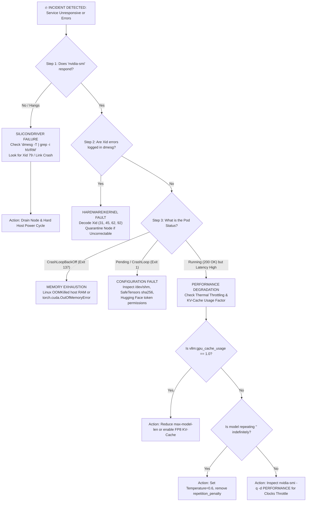

# 39. Master Troubleshooting Playbook — Root Cause Analysis & Rapid Triage

> **Target Audience**: AI Systems Engineers, Data Center SREs, Kubernetes Operators, and On-Call Infrastructure Specialists responsible for triaging mission-critical LLM outages on NVIDIA DGX Spark.  
> **Prerequisites**: Proficiency with Linux system diagnostics (`dmesg`, `journalctl`), NVIDIA command-line tools (`nvidia-smi`), and Kubernetes pod management (`kubectl`).  
> **Estimated Deep-Dive Time**: 50 minutes  
> **What You Will Master**:
> 1. The Unified AI Diagnostic Decision Tree: Systematically isolating faults between physical silicon, kernel drivers, container runtimes, inference engines, and prompt dynamics.
> 2. Exhaustive triage workflows for CUDA Out-of-Memory (OOM, Exit Code 137) and KV-cache exhaustion.
> 3. The complete NVIDIA Hardware Xid Error Matrix for Grace Blackwell architectures (Xid 31, 43, 62, 79, and 92) with exact remediation protocols.
> 4. Root cause analysis for reasoning model degradation: infinite `<think>` generation loops, repetitive attractor basins, and sampling temperature traps.
> 5. An automated, production-grade 60-second diagnostic triage script auditing GPU hardware, system kernel buffers, and vLLM inference health.
> 6. Step-by-step incident drills with full command solutions and post-mortem procedures.

---

## 📑 Table of Contents
1. [Zero-to-One Intuition: The 5-Layer AI Incident Hierarchy](#1-zero-to-one-intuition-the-5-layer-ai-incident-hierarchy)
2. [Master AI Diagnostic Decision Tree](#2-master-ai-diagnostic-decision-tree)
3. [Triage Runbook 1: CUDA Out of Memory (OOM) & Pod Exit 137](#3-triage-runbook-1-cuda-out-of-memory-oom--pod-exit-137)
4. [Triage Runbook 2: NVIDIA Hardware Xid Errors on Blackwell GB10](#4-triage-runbook-2-nvidia-hardware-xid-errors-on-blackwell-gb10)
5. [Triage Runbook 3: Model Degradation & Infinite `<think>` Loops](#5-triage-runbook-3-model-degradation--infinite-think-loops)
6. [Triage Runbook 4: Silent Throughput Drops & Thermal Throttling](#6-triage-runbook-4-silent-throughput-drops--thermal-throttling)
7. [Triage Runbook 5: NCCL Watchdog Timeouts & Communication Stalls](#7-triage-runbook-5-nccl-watchdog-timeouts--communication-stalls)
8. [Hands-On Production Lab: The 60-Second Automated Triage Suite](#8-hands-on-production-lab-the-60-second-automated-triage-suite)
9. [Hardware Grounding for NVIDIA DGX Spark (Grace Blackwell GB10)](#9-hardware-grounding-for-nvidia-dgx-spark-grace-blackwell-gb10)
10. [Step-by-Step Incident Drills with Solutions](#10-step-by-step-incident-drills-with-solutions)
11. [Troubleshooting & Operational FAQ](#11-troubleshooting--operational-faq)

---

## 1. Zero-to-One Intuition: The 5-Layer AI Incident Hierarchy

When an enterprise LLM platform fails, symptoms can appear deceptively identical: the web UI stops responding, or API clients receive `504 Gateway Timeout`. 

However, the underlying root cause can exist at any of **5 distinct layers**:

```text
+-----------------------------------------------------------------------------------------------+
|                                  THE 5-LAYER AI INCIDENT HIERARCHY                             |
+-----------------------------------------------------------------------------------------------+
|  [5] Prompt / Model Layer   │ Bad Sampling Temp, System Prompt Conflict, Infinite Loop         |
|  [4] Inference Engine Layer │ KV-Cache Allocation Deadlock, PagedAttention Fragmentation      |
|  [3] Container / K8s Layer  │ Linux OOMKiller (Exit 137), Missing /dev/shm, Failed Readiness   |
|  [2] Driver & CUDA Layer    │ Driver Crash, CUDA Version Mismatch, Xid MMU Page Fault         |
|  [1] Physical Silicon Layer │ Thermal Throttling, Transistor Bit-Flip, NVLink-C2C Bus Drop    |
+-----------------------------------------------------------------------------------------------+
```

The fundamental rule of AI incident response is: **Triage from Silicon upwards**. If the GPU has dropped off the PCIe/NVLink bus (Layer 1), restarting the Kubernetes pod (Layer 3) will accomplish nothing except wasting critical SLA response time.

---

## 2. Master AI Diagnostic Decision Tree

Follow this exact sequential triage logic during any high-severity AI outage:



---

## 3. Triage Runbook 1: CUDA Out of Memory (OOM) & Pod Exit 137

### Symptoms
* Kubernetes pod crashes with: `Last State: Terminated - Reason: OOMKilled - Exit Code: 137`.
* Application logs output: `torch.cuda.OutOfMemoryError: CUDA out of memory. Tried to allocate 2.40 GiB (GPU 0; 120.00 GiB total capacity; 118.20 GiB already allocated)`.

### Root Cause Analysis
Two completely different memory allocators can trigger an OOM:
1. **Host OS RAM OOM (Exit 137)**: The Linux kernel OOMKiller terminates the process because host system RAM exceeded the Kubernetes pod `resources.limits.memory`. This commonly happens when loading unquantized SafeTensors weights into CPU RAM before moving them to GPU.
2. **CUDA Device VRAM OOM**: PyTorch or vLLM attempts to allocate GPU device memory, but the pre-allocated KV-cache pool and static weights left insufficient headroom for dynamic scratchpad buffers (e.g., attention logits or cuBLAS workspace).

```text
Memory Distribution on DGX Spark (128 GB Unified):
+-----------------------------------------------------------------------------------+
| Static Weights (32 GB) | Paged KV-Cache Pool (85 GB) | CUDA Overhead (11 GB)       |
+-----------------------------------------------------------------------------------+
▲                                                      ▲
0 GB                                                   117 GB (Overhead Exhausted -> OOM!)
```

### Resolution Protocol
1. **Reduce vLLM Pre-Allocation Factor**:
   Edit the serving launch arguments in `/etc/systemd/system/vllm.service` or Kubernetes deployment manifest:
   ```bash
   # Lower from default 0.95 to 0.90 to provide 6.4 GB additional dynamic workspace
   --gpu-memory-utilization 0.90
   ```
2. **Compress the KV-Cache**:
   Switch from 16-bit to 8-bit KV-cache representations ([Volume 04](04-fp8-mixed-precision-framework.md)):
   ```bash
   --kv-cache-dtype fp8
   ```
3. **Cap Maximum Sequence Length**:
   Prevent runaway client requests from demanding massive memory allocations:
   ```bash
   --max-model-len 32768
   ```
4. **Fix Kubernetes Shared Memory (`/dev/shm`)**:
   PyTorch inter-process tensor sharing requires adequate shared memory. Ensure Kubernetes manifests mount an `emptyDir` backed by memory ([Volume 19](19-kubernetes-manifests-for-deepseek.md)):
   ```yaml
   volumeMounts:
     - mountPath: /dev/shm
       name: dshm
   volumes:
     - name: dshm
       emptyDir:
         medium: Memory
         sizeLimit: 16Gi
   ```

---

## 4. Triage Runbook 2: NVIDIA Hardware Xid Errors on Blackwell GB10

An **Xid error** is a driver-level event logged directly to the Linux kernel ring buffer (`dmesg`) when the NVIDIA GPU encounters an unrecoverable fault.

### Diagnostic Command
```bash
sudo dmesg -T | grep -i "NVRM: Xid"
```

### The Master Grace Blackwell Xid Matrix

| Xid Code | Failure Classification | Physical Root Cause | Immediate Operational Triage Protocol |
| :--- | :--- | :--- | :--- |
| **Xid 31** | GPU Memory Page Fault | A CUDA kernel attempted to read or write an unmapped virtual address. Commonly caused by buggy custom Triton/CUDA kernels. | Inspect recent custom kernel changes (e.g., FlashMLA or DeepGEMM compilation). Revert to standard vLLM CUDA kernels. Node does not require reboot. |
| **Xid 43** | GPU Stopped Processing | GPU engine timeout. A CUDA kernel ran longer than the driver watchdog threshold without yielding. | Increase compute timeout (`nvidia-smi -c DEFAULT`). Check if an infinite loop exists in a custom inference plugin. |
| **Xid 45** | Preemptive Cleanup | Driver reclaimed GPU resources because a parent process crashed or terminated abnormally. | Look at application logs immediately preceding this timestamp to find the userland crash. |
| **Xid 62** | Internal Microcontroller Halt | Internal firmware execution halt in the Blackwell GPU on-chip controller. | Cold power cycle host. If reproducible across clean boots, file NVIDIA RMA for hardware replacement. |
| **Xid 79** | GPU Fallen Off the Bus | Hardware link failure across NVLink-C2C or PCIe bus. Physical link communication lost. | **Immediate Node Quarantine**. The GPU is dead to the OS. Run `kubectl drain <node> --delete-emptydir-data`. Trigger cold physical reboot via IPMI/BMC. |
| **Xid 92** | High-Bandwidth Memory (HBM) Uncorrectable ECC | Physical silicon DRAM bit-flip that could not be corrected by Hamming ECC circuitry. | **Fatal Hardware Defect**. Corrupted data may have leaked into weights. Mark node unschedulable (`cordon`). Execute memory diagnostic: `dcgmproftester12 --no-dcgm-validation -t 1004`. |

---

## 5. Triage Runbook 3: Model Degradation & Infinite `<think>` Loops

### Symptoms
* DeepSeek-R1 responses hang indefinitely while continuously emitting reasoning tokens.
* The model enters self-reinforcing loops, repeating variations of:  
  *"Wait, let me rethink step 2... But actually, let me reconsider step 2 again..."*
* Requests hit `--max-model-len` without ever closing the `</think>` tag or generating an answer.

```text
Runaway Reasoning Loop:
[Token 100]  "Wait, let's verify if the matrix is invertible."
[Token 500]  "Let me re-check that calculation."
[Token 1200] "Wait, let's verify if the matrix is invertible."  <── Loop Attractor
[Token 2400] "Let me re-check that calculation."
[Token 8192] Context Window Exhausted! (HTTP 504 / Empty Answer)
```

### Root Cause Analysis
1. **Sampling Temperature Set to 0.0 (Greedy Decoding)**: Reinforcement-learned reasoning models require stochastic exploration to escape local minima in reasoning space. Greedy decoding ($T=0.0$) forces the model into circular reasoning loops.
2. **Aggressive Repetition Penalty**: Setting `repetition_penalty > 1.0` disrupts the model's ability to repeat mathematical variable names, indices, and syntax in reasoning proofs.
3. **Missing System Prompt Directives**: DeepSeek-R1 requires unconstrained deliberation room. Adding restrictive system prompts like *"Answer concisely in one sentence"* conflicts with its RL policy, causing severe degradation.

### Resolution Protocol
1. **Enforce Official DeepSeek Sampling Hyperparameters**:
   ```json
   {
     "temperature": 0.6,
     "top_p": 0.95,
     "presence_penalty": 0.0,
     "frequency_penalty": 0.0
   }
   ```
2. **Inject Stop Sequences in the Serving Engine**:
   Configure vLLM or LiteLLM to terminate generation if reasoning runs away:
   ```json
   {
     "stop": ["<｜end of sentence｜>", "</think>\n\n\n"]
   }
   ```
3. **Strip Arbitrary System Prompts**: Remove aggressive formatting constraints from user prompts when routing to DeepSeek-R1.

---

## 6. Triage Runbook 4: Silent Throughput Drops & Thermal Throttling

### Symptoms
* Token generation throughput silently drops from 45 tok/s to $< 8\text{ tok/s}$.
* No errors appear in container logs or `dmesg`.

### Root Cause Analysis
The NVIDIA driver automatically down-clocks the GPU silicon when operating conditions exceed safety thresholds:
* **Thermal Slowdown**: Die temperature exceeds $83^\circ\text{C}$.
* **Power Capping**: Board power draw exceeds configured limit (e.g., 350W).

### Verification Command
```bash
nvidia-smi -q -d PERFORMANCE,CLOCK,POWER,TEMPERATURE
```

Inspect the output for:
```text
Clocks Event Reasons:
    HW Slowdown                 : Active   <── THERMAL EMERGENCY!
    SW Power Cap                : Active   <── POWER BUDGET BREACH!
```

### Resolution Protocol
1. **Check Chassis Airflow**: Verify server fan RPM via IPMI (`ipmitool sensor | grep Fan`). If fans are failing, migrate pods immediately.
2. **Inspect Grace ARM CPU Governor**: Ensure the 72-core Neoverse V2 CPU is running in high-performance mode:
   ```bash
   sudo cpupower frequency-set -g performance
   ```

---

## 7. Triage Runbook 5: NCCL Watchdog Timeouts & Communication Stalls

### Symptoms
* Multi-GPU or multi-node training/serving hangs indefinitely.
* Logs display: `Watchdog caught collective operation timeout: WorkNCCL(OpCount=1244, TimeoutMs=600000) ran for 600002 milliseconds`.

### Root Cause Analysis
In distributed operations (e.g., MoE All-to-All or RingAttention context parallelism), every GPU rank must reach the collective barrier. If **one single GPU** stalls due to a slow memory fetch or OS jitter, all other GPUs wait until the NCCL watchdog timer aborts the entire cluster.

### Resolution Protocol
1. **Enable Detailed NCCL Diagnostics**:
   Set environment variables in the pod specification:
   ```bash
   export NCCL_DEBUG=INFO
   export NCCL_DEBUG_SUBSYS=INIT,COLL,ENV
   export NCCL_BUFFSIZE=16777216
   ```
2. **Pin Interface to High-Speed Fabrics**:
   Prevent NCCL from routing cross-node tensor traffic over slow 1GbE management interfaces:
   ```bash
   export NCCL_SOCKET_IFNAME=eth0,bond0
   export NCCL_IB_DISABLE=0
   ```

---

## 8. Hands-On Production Lab: The 60-Second Automated Triage Suite

This self-contained Python script performs a comprehensive 60-second health inspection of the entire DGX Spark stack. It audits physical GPU silicon, driver states, kernel Xid logs, and the local vLLM serving engine.

Save this script as `dgx_spark_triage.py` and run it with `sudo python3 dgx_spark_triage.py`:

```python
#!/usr/bin/env python3
"""
NVIDIA DGX Spark Automated 60-Second Rapid Triage Suite
Author: Advanced AI Architecture Group
Target: Grace ARM Neoverse V2 + Blackwell GB10
"""

import json
import os
import subprocess
import sys
import urllib.request

def run_cmd(cmd: str) -> Tuple[int, str]:
    try:
        res = subprocess.run(cmd, shell=True, stdout=subprocess.PIPE, stderr=subprocess.PIPE, text=True, timeout=10)
        return res.returncode, res.stdout.strip()
    except Exception as e:
        return -1, str(e)

def audit_silicon_and_driver():
    print("\n[STEP 1: SILICON & DRIVER AUDIT]")
    # Check if nvidia-smi responds
    code, out = run_cmd("nvidia-smi --query-gpu=name,driver_version,temperature.gpu,power.draw,utilization.gpu --format=csv,noheader")
    if code != 0:
        print("  ❌ CRITICAL: nvidia-smi failed to respond! GPU may have fallen off the bus (Xid 79).")
        return False
    
    parts = [p.strip() for p in out.split(",")]
    print(f"  ✅ GPU Detected:        {parts[0]}")
    print(f"  ✅ Driver Version:      {parts[1]}")
    print(f"  ✅ Die Temperature:     {parts[2]} (Threshold: <80°C)")
    print(f"  ✅ Power Draw:          {parts[3]}")
    print(f"  ✅ Core Utilization:    {parts[4]}")
    return True

def audit_kernel_xid():
    print("\n[STEP 2: KERNEL XID ERROR LOG AUDIT]")
    code, out = run_cmd("dmesg -T | grep -i 'NVRM: Xid' | tail -n 5")
    if code == 0 and len(out) > 0:
        print("  ❌ CRITICAL: Hardware Xid errors detected in kernel ring buffer:")
        for line in out.splitlines():
            print(f"     {line}")
        return False
    else:
        print("  ✅ Zero Xid hardware errors found in recent kernel logs.")
        return True

def audit_vllm_engine():
    print("\n[STEP 3: INFERENCE RUNTIME ENGINE HEALTH]")
    health_url = "http://localhost:8000/health"
    metrics_url = "http://localhost:8000/metrics"
    
    try:
        req = urllib.request.Request(health_url)
        with urllib.request.urlopen(req, timeout=3) as resp:
            if resp.status == 200:
                print(f"  ✅ vLLM Health Check:   200 OK (Service is admitting traffic)")
    except Exception as e:
        print(f"  ❌ WARNING: vLLM Health Check failed at {health_url}: {e}")
        return False

    try:
        req = urllib.request.Request(metrics_url)
        with urllib.request.urlopen(req, timeout=3) as resp:
            content = resp.read().decode('utf-8')
            for line in content.splitlines():
                if line.startswith("vllm:gpu_cache_usage_factor"):
                    val = float(line.split()[-1])
                    print(f"  ✅ KV-Cache Usage:      {val*100:.1f}%")
                    if val > 0.95:
                        print("     ⚠️ ALERT: KV-cache near exhaustion (>95%)!")
                elif line.startswith("vllm:num_requests_waiting"):
                    val = int(float(line.split()[-1]))
                    print(f"  ✅ Requests Queued:     {val}")
                    if val > 5:
                        print("     ⚠️ ALERT: Heavy request backlog queued!")
    except Exception as e:
        print(f"  ⚠️ Warning: Could not scrape metrics: {e}")

    return True

def main():
    print("=" * 75)
    print("      NVIDIA DGX SPARK 60-SECOND RAPID TRIAGE SUITE")
    print("=" * 75)
    
    s1 = audit_silicon_and_driver()
    s2 = audit_kernel_xid()
    s3 = audit_vllm_engine()

    print("\n" + "=" * 75)
    if s1 and s2 and s3:
        print("TRIAGE RESULT: SYSTEM OPERATIONAL (All hardware & software green)")
    else:
        print("TRIAGE RESULT: ANOMALY DETECTED (Review diagnostic steps above)")
    print("=" * 75)

if __name__ == "__main__":
    from typing import Tuple
    main()
```

---

## 9. Hardware Grounding for NVIDIA DGX Spark (Grace Blackwell GB10)

Troubleshooting the **NVIDIA DGX Spark** requires understanding the unified bus coupling between the Grace CPU and Blackwell GPU:

```
+------------------------------------------------------------------------------------+
|                         DGX SPARK HARDWARE BUS TOPOLOGY                            |
+------------------------------------------------------------------------------------+
|  Grace ARM CPU                                     Blackwell GB10 GPU              |
|  ┌───────────────────────────┐                     ┌───────────────────────────┐   |
|  │ 72x Neoverse V2 Cores     │                     │ Tensor Cores & SMs        │   |
|  │ SVE2 4x128-bit Vector     │                     │ FP8 Transformer Engine    │   |
|  └─────────────┬─────────────┘                     └─────────────┬─────────────┘   |
|                │                                                 │                 |
|                └──────────────── NVLink-C2C ─────────────────────┘                 |
|                                 900 GB/s Bi-Directional                            |
|                                 (Check for Flit CRC Errors)                        |
|                                              │                                     |
|                                              ▼                                     |
|                              128 GB Unified LPDDR5X Memory                         |
+------------------------------------------------------------------------------------+
```

### Specific GB10 Hardware Triage Steps
1. **NVLink-C2C Bus Dropouts**: If `nvidia-smi` hangs, do not reboot with `sudo reboot` (the OS may hang waiting for un-syncable GPU pages). Issue an IPMI power cycle:
   ```bash
   ipmitool chassis power reset
   ```
2. **Unified Memory Coherency Check**: When checking for OOMs, examine both GPU memory and host memory simultaneously. On GB10, a runaway host process (like a giant Python dataframe) consumes memory from the exact same physical LPDDR5X bank used by vLLM's KV-cache.

---

## 10. Step-by-Step Incident Drills with Solutions

### Drill 1: Resolving a Runaway Memory Crash (Exit Code 137)
* **Incident**: Following a burst of user requests, the `deepseek-r1-serving` pod crashes with `ExitCode: 137`.
* **Action Steps**:
  1. Inspect pod termination reasons:
     ```bash
     kubectl describe pod -n ai-serving -l app=deepseek-r1 | grep -E "Exit Code|Reason"
     ```
  2. If `OOMKilled`, inspect container memory limits vs vLLM flags:
     ```bash
     kubectl get deployment -n ai-serving deepseek-r1 -o yaml | grep -A 5 resources
     ```
  3. Patch the deployment to limit KV-cache pre-allocation and enable FP8 cache:
     ```bash
     kubectl set env deployment/deepseek-r1 -n ai-serving \
       VLLM_GPU_MEMORY_UTILIZATION="0.88" \
       VLLM_KV_CACHE_DTYPE="fp8"
     ```

---

### Drill 2: Quarantining a Node with Hardware Xid 79
* **Incident**: An alert fires: `NVIDIAHardwareXidFault (Xid 79: GPU fallen off bus)`.
* **Action Steps**:
  1. Immediately cordon the DGX Spark node to prevent Kubernetes from scheduling new pods:
     ```bash
     kubectl cordon dgx-spark-node-01
     ```
  2. Evacuate running workloads safely:
     ```bash
     kubectl drain dgx-spark-node-01 --ignore-daemonsets --delete-emptydir-data --force
     ```
  3. Attempt bus re-enumeration from host terminal:
     ```bash
     sudo nvidia-smi --gpu-reset -i 0
     ```
  4. If reset fails (expected on Xid 79), trigger out-of-band chassis reboot via BMC:
     ```bash
     ipmitool -H 192.168.1.100 -U admin -P secret chassis power cycle
     ```

---

### Drill 3: Rescuing DeepSeek-R1 from an Infinite Deliberation Loop
* **Incident**: Users report that queries containing complex logic hang for 2 minutes and return incomplete text.
* **Action Steps**:
  1. Inspect current active inference parameters passed by client applications in LiteLLM logs:
     ```bash
     kubectl logs -n ai-serving -l app=litellm-proxy --tail=100 | grep "temperature"
     ```
  2. Identify that client was requesting `temperature: 0.0`.
  3. Apply an overriding parameter policy in LiteLLM ConfigMap ([Volume 28](28-litellm-proxy-gateway-load-balancing.md)):
     ```yaml
     model_list:
       - model_name: "deepseek-r1"
         litellm_params:
           model: "openai/DeepSeek-R1-Distill-32B"
           override_params:
             temperature: 0.6
             top_p: 0.95
     ```
  4. Reload LiteLLM configuration without downtime:
     ```bash
     curl -X POST http://localhost:4000/config/reload
     ```

---

## 11. Troubleshooting & Operational FAQ

### Q1: Why does `nvidia-smi` report high memory usage immediately upon pod boot, before any requests arrive?
**Expected Behavior**: Serving engines like vLLM and SGLang pre-allocate their entire designated KV-cache pool upfront on initialization (controlled by `--gpu-memory-utilization`, default `0.90`). This is intentional design to prevent unpredictable memory fragmentation during live serving.

### Q2: What should I do if `safetensors_rust.SafetensorError: Error while deserializing header` occurs during boot?
**Root Cause**: Model weights were interrupted or corrupted during download over the network.  
**Remediation**: Run the cryptographic audit script from [Volume 33](33-automated-weight-sync-and-day2-ops.md) to identify the specific truncated shard, delete it, and re-download with `hf_transfer`.

### Q3: When should a node be physically RMA'd versus rebooted?
**Decision Rule**:
* **Soft Reboots Suffice**: Transient CUDA runtime crashes, Xid 31 (bad kernel code), Xid 43 (driver watchdog timeout), and soft single-bit ECC errors corrected by driver.
* **Hardware RMA Required**: Persistent Xid 62 (microcode halt across cold boots), Xid 92 (uncorrectable physical HBM silicon faults), and physical NVLink CRC failure counts steadily incrementing under load.

---

### Complete Curriculum Navigation
| Previous Volume | Master Curriculum Navigation | Next Volume |
| :--- | :---: | :---: |
| [← 38. DCGM, Prometheus & Grafana Telemetry](38-dcgm-prometheus-and-grafana-telemetry.md) | [Curriculum Index](README.md) | [40. 40 Hands-On Practice Exercises Workbook →](40-hands-on-exercises-workbook.md) |
