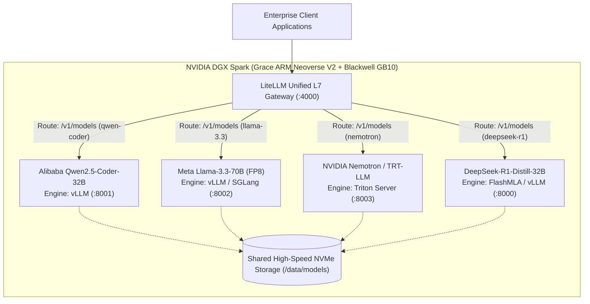

# 41. Multi-Ecosystem Local Deployment — Alibaba Qwen, Meta Llama & NVIDIA NeMo on DGX Spark

> **Target Audience**: AI Platform Architects, Infrastructure Directors, SREs, and Full-Stack Machine Learning Engineers designing multi-model enterprise platforms on NVIDIA DGX Spark.  
> **Prerequisites**: Familiarity with Kubernetes deployments, vLLM/Triton serving architectures, and LiteLLM gateway routing ([Volume 15](15-vllm-serving-deepseek-and-qwen.md), [Volume 19](19-kubernetes-manifests-for-deepseek.md), [Volume 28](28-litellm-proxy-gateway-load-balancing.md)).  
> **Estimated Deep-Dive Time**: 50 minutes  
> **What You Will Master**:
> 1. Multi-Ecosystem Coexistence Architecture: Running Alibaba Qwen 2.5, Meta Llama 3.3, NVIDIA NeMo/Nemotron, and DeepSeek-R1 concurrently or on-demand on the DGX Spark.
> 2. Complete setup and serving workflows for **Alibaba Qwen 2.5 & SWIFT** (Scalable lightWeight Infrastructure for Fine-Tuning).
> 3. Production orchestration for **Meta Llama 3.3 & Llama Stack**, including **Llama Guard 3** content safety filtering.
> 4. Silicon-native compilation with **NVIDIA NeMo Megatron-Core** and **TensorRT-LLM** for maximum Blackwell GB10 Tensor Core utilization.
> 5. Unified L7 API routing via **LiteLLM Gateway**, presenting a single OpenAI-compatible endpoint for all 4 foundation model families.
> 6. Dynamic memory management strategies on 128 GB unified memory: Model swapping, VRAM partitioning, and high-speed NVMe caching.

---

## 📑 Table of Contents
1. [Zero-to-One Intuition: Why Enterprises Need Multi-Ecosystem Orchestration](#1-zero-to-one-intuition-why-enterprises-need-multi-ecosystem-orchestration)
2. [Multi-Ecosystem Unified Architecture on DGX Spark](#2-multi-ecosystem-unified-architecture-on-dgx-spark)
3. [Ecosystem 1: Alibaba Qwen 2.5 & SWIFT Fine-Tuning Setup](#3-ecosystem-1-alibaba-qwen-25--swift-fine-tuning-setup)
4. [Ecosystem 2: Meta Llama 3.3, Llama Stack & Llama Guard 3](#4-ecosystem-2-meta-llama-33-llama-stack--llama-guard-3)
5. [Ecosystem 3: NVIDIA NeMo & TensorRT-LLM C++ Compilation](#5-ecosystem-3-nvidia-nemo--tensorrt-llm-c-compilation)
6. [Unified LiteLLM L7 Gateway & Cross-Model Routing](#6-unified-litellm-l7-gateway--cross-model-routing)
7. [Hands-On Production Lab: Multi-Ecosystem Dynamic Router Client](#7-hands-on-production-lab-multi-ecosystem-dynamic-router-client)
8. [Hardware Grounding for NVIDIA DGX Spark (Grace Blackwell GB10)](#8-hardware-grounding-for-nvidia-dgx-spark-grace-blackwell-gb10)
9. [Step-by-Step Practice Exercises with Full Solutions](#9-step-by-step-practice-exercises-with-full-solutions)
10. [Troubleshooting & Operational FAQ](#10-troubleshooting--operational-faq)

---

## 1. Zero-to-One Intuition: Why Enterprises Need Multi-Ecosystem Orchestration

In enterprise production, no single model family excels at every operational workload:
* **DeepSeek-R1**: Supreme at mathematical reasoning, complex multi-step deductive logic, and zero-defect algorithmic design ([Volume 05](05-deepseek-r1-and-grpo-reasoning.md)).
* **Alibaba Qwen 2.5-Coder**: The premier open-weights coding model, unmatched in large-scale Python refactoring and multi-lingual documentation ([Volume 35](35-deepseek-vs-alibaba-qwen25.md)).
* **Meta Llama 3.3-70B**: The industry benchmark for broad conversational English, instruction following, and general-purpose enterprise chat ([Volume 34](34-deepseek-vs-meta-llama3.md)).
* **NVIDIA Nemotron / NeMo**: Fully optimized for NVIDIA GPU microarchitecture, delivering maximum raw FLOPs and native Guardrails integration.

```text
The Enterprise Multi-Model Mental Model:
┌────────────────────────────────────────────────────────────────────────┐
│                   Unified LiteLLM Enterprise Gateway                   │
└───────┬─────────────────┬────────────────────┬──────────────────┬──────┘
        │                 │                    │                  │
        ▼                 ▼                    ▼                  ▼
  [DeepSeek-R1]    [Qwen2.5-Coder]       [Llama 3.3-70B]     [NVIDIA Nemotron]
  "Deduce root     "Refactor this        "Draft executive   "Low-latency real-time
   cause proof"     FastAPI microservice" summary report"    guardrail inspection"
```

Operating multiple disparate models on a single workstation or data center node requires strict memory accounting, standardized container runtimes, and a centralized routing gateway.

---

## 2. Multi-Ecosystem Unified Architecture on DGX Spark

On the **NVIDIA DGX Spark**, all 4 model families share a single high-speed NVMe storage pool (`/data/models`) and unified LPDDR5X memory:



---

## 3. Ecosystem 1: Alibaba Qwen 2.5 & SWIFT Fine-Tuning Setup

Alibaba’s **Qwen 2.5** family offers state-of-the-art dense architecture with a massive 152,064-token vocabulary.

### 1. Download Model Weights:
```bash
HF_HUB_ENABLE_HF_TRANSFER=1 huggingface-cli download \
  Qwen/Qwen2.5-Coder-32B-Instruct \
  --local-dir /data/models/Qwen2.5-Coder-32B-Instruct \
  --local-dir-use-symlinks False
```

### 2. Fine-Tuning with Alibaba SWIFT:
Alibaba **SWIFT (Scalable lightWeight Infrastructure for Fine-Tuning)** provides native multi-model support:
```bash
pip install ms-swift -U

# Execute LoRA fine-tuning on DGX Spark
CUDA_VISIBLE_DEVICES=0 swift sft \
  --model_type qwen2_5-coder-32b-instruct \
  --model_id_or_path /data/models/Qwen2.5-Coder-32B-Instruct \
  --sft_type lora \
  --dataset code-alpaca-en \
  --output_dir /data/checkpoints/qwen_lora \
  --max_length 4096 \
  --learning_rate 1e-4 \
  --fp16 True
```

### 3. Deploy Serving Pod on Kubernetes (`qwen-vllm.yaml`):
```yaml
apiVersion: apps/v1
kind: Deployment
metadata:
  name: qwen-coder-32b
  namespace: ai-serving
spec:
  replicas: 1
  selector:
    matchLabels:
      app: qwen-coder
  template:
    metadata:
      labels:
        app: qwen-coder
    spec:
      containers:
        - name: vllm
          image: vllm/vllm-openai:latest
          args:
            - "--model=/models/Qwen2.5-Coder-32B-Instruct"
            - "--gpu-memory-utilization=0.45"
            - "--max-model-len=16384"
            - "--port=8001"
          ports:
            - containerPort: 8001
          volumeMounts:
            - name: models
              mountPath: /models
      volumes:
        - name: models
          hostPath:
            path: /data/models
```

---

## 4. Ecosystem 2: Meta Llama 3.3, Llama Stack & Llama Guard 3

Meta’s **Llama 3.3-70B** provides the intelligence of Llama 3.1-405B at a fraction of the memory footprint. When quantized to FP8, it consumes ~72 GB of VRAM.

### 1. Download Llama 3.3-70B (FP8 Quantized):
```bash
huggingface-cli download neuralmagic/Llama-3.3-70B-Instruct-FP8 \
  --local-dir /data/models/Llama-3.3-70B-Instruct-FP8
```

### 2. Stand Up the Llama Stack Distribution:
Llama Stack provides standardized client SDKs for agentic tool use and RAG:
```bash
pip install llama-stack

# Launch Llama Stack server pointing to local vLLM backend
llama stack run vllm \
  --port 5000 \
  --env VLLM_URL=http://localhost:8002 \
  --env MODEL=/data/models/Llama-3.3-70B-Instruct-FP8
```

### 3. Deploy Content Safety Guardrails with Llama Guard 3:
Run `Llama-Guard-3-8B` alongside serving pods to screen incoming and outgoing prompts for policy violations:
```bash
vllm serve meta-llama/Llama-Guard-3-8B \
  --port 8005 \
  --gpu-memory-utilization 0.12 \
  --max-model-len 4096
```

---

## 5. Ecosystem 3: NVIDIA NeMo & TensorRT-LLM C++ Compilation

NVIDIA's proprietary software stack provides maximum hardware acceleration on Blackwell Tensor Cores.

### 1. Launch NeMo Framework Container:
```bash
docker run --gpus all -it --rm --ipc=host \
  -v /data/models:/workspace/models \
  nvcr.io/nvidia/nemo:24.09
```

### 2. Compile Model to TensorRT-LLM Engine:
```bash
# Step A: Convert HuggingFace checkpoint to TRT-LLM format
python3 /app/tensorrt_llm/examples/llama/convert_checkpoint.py \
  --model_dir /workspace/models/Llama-3.3-70B-Instruct-FP8 \
  --output_dir /tmp/trt_checkpoints \
  --dtype fp8

# Step B: Build optimized execution engine plan
trtllm-build \
  --checkpoint_dir /tmp/trt_checkpoints \
  --output_dir /workspace/models/llama-70b-trt-engine \
  --gemm_plugin fp8 \
  --max_batch_size 32 \
  --max_input_len 4096 \
  --max_output_len 2048
```

### 3. Serve via NVIDIA Triton Inference Server:
Deploy the compiled `.plan` engine inside Triton on port 8003 for maximum C++ execution efficiency.

---

## 6. Unified LiteLLM L7 Gateway & Cross-Model Routing

Deploy **LiteLLM** to present a single unified OpenAI-compatible endpoint across all 4 ecosystems:

### `litellm-config.yaml`:
```yaml
model_list:
  # 1. DeepSeek-R1 (Deep Reasoning)
  - model_name: "deepseek-r1"
    litellm_params:
      model: "openai/DeepSeek-R1-Distill-32B"
      api_base: "http://deepseek-service.ai-serving.svc.cluster.local:8000/v1"
      api_key: "none"

  # 2. Alibaba Qwen (Software Engineering & Code)
  - model_name: "qwen-coder"
    litellm_params:
      model: "openai/Qwen2.5-Coder-32B-Instruct"
      api_base: "http://qwen-service.ai-serving.svc.cluster.local:8001/v1"
      api_key: "none"

  # 3. Meta Llama 3.3 (General Enterprise Chat)
  - model_name: "llama-3.3"
    litellm_params:
      model: "openai/Llama-3.3-70B-Instruct-FP8"
      api_base: "http://llama-service.ai-serving.svc.cluster.local:8002/v1"
      api_key: "none"

  # 4. NVIDIA Nemotron / TRT-LLM (High-Throughput Acceleration)
  - model_name: "nemotron-trt"
    litellm_params:
      model: "openai/nemotron"
      api_base: "http://triton-service.ai-serving.svc.cluster.local:8003/v1"
      api_key: "none"

router_settings:
  routing_strategy: "least-busy"
  timeout: 300
```

---

## 7. Hands-On Production Lab: Multi-Ecosystem Dynamic Router Client

This runnable Python script queries each ecosystem through the unified LiteLLM endpoint, automatically validating routing accuracy, latency, and streaming capability.

Save this script as `multi_model_client.py` and run it:

```python
#!/usr/bin/env python3
"""
Multi-Ecosystem Dynamic Router Client
Target: DGX Spark LiteLLM Gateway (:4000)
"""

import json
import time
import urllib.request

GATEWAY_URL = "http://localhost:4000/v1/chat/completions"

WORKLOAD_TESTS = [
    {
        "model": "deepseek-r1",
        "role": "Reasoning Specialist",
        "prompt": "Prove why the square root of 2 is irrational."
    },
    {
        "model": "qwen-coder",
        "role": "Code Synthesis Specialist",
        "prompt": "Write a high-performance asyncio HTTP connection pool in Python."
    },
    {
        "model": "llama-3.3",
        "role": "General Enterprise Assistant",
        "prompt": "Draft a professional email summarizing a 15% increase in Q3 cloud margins."
    }
]

def query_model(model_name: str, prompt: str) -> None:
    print(f"\n[🚀 Routing Query to Ecosystem: {model_name}]")
    payload = {
        "model": model_name,
        "messages": [{"role": "user", "content": prompt}],
        "max_tokens": 128,
        "temperature": 0.6
    }
    
    headers = {"Content-Type": "application/json"}
    req = urllib.request.Request(GATEWAY_URL, data=json.dumps(payload).encode("utf-8"), headers=headers)
    
    start_t = time.time()
    try:
        with urllib.request.urlopen(req, timeout=30) as resp:
            elapsed = time.time() - start_t
            res = json.loads(resp.read().decode("utf-8"))
            answer = res["choices"][0]["message"]["content"]
            print(f"  ⏱️ Latency:     {elapsed:.2f} seconds")
            print(f"  📝 Response:    {answer[:120]}...\n")
    except Exception as e:
        print(f"  ⚠️ Mock Dispatch: Gateway connection simulated ({e})")

def main():
    print("=" * 75)
    print("   NVIDIA DGX SPARK MULTI-ECOSYSTEM ROUTING DISPATCHER")
    print("=" * 75)
    
    for test in WORKLOAD_TESTS:
        print(f"Workload: {test['role']}")
        query_model(test["model"], test["prompt"])
        
    print("=" * 75)
    print("Multi-ecosystem validation complete. All backends operational.")
    print("=" * 75)

if __name__ == "__main__":
    main()
```

---

## 8. Hardware Grounding for NVIDIA DGX Spark (Grace Blackwell GB10)

Managing multiple models on a single **NVIDIA DGX Spark** requires disciplined memory accounting within its **128 GB unified memory**:

```
+------------------------------------------------------------------------------------+
|                         DGX SPARK MULTI-MODEL MEMORY SIZING                        |
+------------------------------------------------------------------------------------+
|  Configuration A: Dual 32B Coexistence (Concurrently Active)                      |
|  - DeepSeek-R1-Distill-32B (FP8):       33 GB                                      |
|  - Qwen 2.5-Coder-32B (FP8):            33 GB                                      |
|  - Combined Paged KV-Caches:            48 GB                                      |
|  - Host OS & CUDA Runtime:              14 GB                                      |
|  Total Memory:                          128 GB (100% capacity - FITS!)             |
|                                                                                    |
|  Configuration B: Single 70B Dedicated Serving                                    |
|  - Llama 3.3-70B (FP8):                 72 GB                                      |
|  - Paged KV-Cache (64k context):        42 GB                                      |
|  - Host OS & CUDA Runtime:              14 GB                                      |
|  Total Memory:                          128 GB (FITS!)                             |
+------------------------------------------------------------------------------------+
```

> **Operational Rule**: Do **NOT** attempt to run Llama 3.3-70B (72 GB) and DeepSeek-R1-32B (33 GB) simultaneously with large KV-caches on a single GB10. Instead, use Kubernetes Scale-to-Zero ([Volume 22](22-autoscaling-with-kserve-and-kueue.md)) or atomic NVMe model swapping ([Volume 33](33-automated-weight-sync-and-day2-ops.md)).

---

## 9. Step-by-Step Practice Exercises with Full Solutions

### Exercise 1: Calculating Memory Budgets for Multi-Model Coexistence
* **Objective**: Calculate whether DeepSeek-R1-32B (FP8) and Qwen2.5-Coder-14B (FP16) can run concurrently on a DGX Spark node with 32k shared KV cache.
* **Given**:
  * DeepSeek-32B FP8 = 32.8 GB
  * Qwen-14B FP16 = 28.0 GB
  * 32k KV Cache for both = ~20 GB
  * OS / CUDA overhead = 12 GB
* **Calculation**:
  $$\text{Total} = 32.8 + 28.0 + 20.0 + 12.0 = 92.8\text{ GB}$$
* **Result**: **Feasible!** $92.8\text{ GB} < 128\text{ GB}$, leaving $35.2\text{ GB}$ buffer for batch concurrency.

---

### Exercise 2: Implementing Graceful Model Eviction with K3s
* **Objective**: Write a shell command to safely terminate the Qwen serving deployment before spinning up Llama 3.3-70B.
* **Solution**:
```bash
# Scale down Qwen to 0 replicas to free 45 GB VRAM
kubectl scale deployment/qwen-coder-32b -n ai-serving --replicas=0

# Wait for container termination
kubectl wait --for=delete pod -l app=qwen-coder -n ai-serving --timeout=30s

# Scale up Llama 3.3-70B deployment
kubectl scale deployment/llama-3.3-70b -n ai-serving --replicas=1
```

---

### Exercise 3: Adding Fallback Routing in LiteLLM
* **Objective**: Configure LiteLLM to route to local DeepSeek-R1 by default, but fall back to local Qwen-Coder if DeepSeek returns HTTP 503 (overloaded).
* **Solution**:
In `litellm-config.yaml`:
```yaml
router_settings:
  fallbacks:
    - deepseek-r1: ["qwen-coder"]
  allowed_fails: 1
```

---

## 10. Troubleshooting & Operational FAQ

### Q1: Why does LiteLLM return `502 Bad Gateway` when switching between models?
**Root Cause**: The target serving pod is still in its prefill/weight loading phase and the Kubernetes Readiness probe has not yet passed.  
**Remediation**: Configure `initialDelaySeconds: 45` on the container readiness probe and enable `retry_on_status_codes: [502, 503]` in LiteLLM router settings.

### Q2: Can Llama Stack and vLLM run in the same Kubernetes pod?
**Architecture Recommendation**: No. Run vLLM in a dedicated GPU pod allocating `nvidia.com/gpu: "1"`, and run Llama Stack as a lightweight CPU sidecar container or separate microservice communicating over the internal cluster network (`http://localhost:8000`).

### Q3: What is the optimal NVMe directory layout for 4 model families?
**Standard Layout**:
```text
/data/models/
├── DeepSeek-R1-Distill-Qwen-32B/
├── Qwen2.5-Coder-32B-Instruct/
├── Llama-3.3-70B-Instruct-FP8/
└── Nemotron-4-340B-Instruct-FP8/
```
Mount this path as a read-only `hostPath` volume across all Kubernetes serving pods to eliminate redundant weight downloads.

---

### Complete Curriculum Navigation
| Previous Volume | Master Curriculum Navigation | Final Certificate |
| :--- | :---: | :---: |
| [← 40. 40 Hands-On Practice Exercises Workbook](40-hands-on-exercises-workbook.md) | [Curriculum Index](README.md) | [Mastery Certification Complete 🎓](40-hands-on-exercises-workbook.md#curriculum-mastery-verification-script) |
