# DeepSeek & Modern AI Ecosystem Mastery Curriculum (41 Volumes)

Welcome to the **DeepSeek & Modern AI Architecture Curriculum** engineered specifically for the **NVIDIA DGX Spark (Grace Blackwell GB10)** platform.

This 41-volume curriculum covers the complete DeepSeek and frontier open-source AI ecosystem — from the mathematical foundations of **Multi-Head Latent Attention (MLA)**, **DeepSeekMoE**, and **GRPO reasoning**, to DeepSeek's open-source infrastructure tools (**FlashMLA, DeepGEMM, DualPipe, EPLB, 3FS**), model sizing (30B/32B parameter models), Kubernetes deployment, fine-tuning, competitive analysis, Ansible/Vault automation, and local deployment runbooks for alternative open frontier ecosystems (**Alibaba Qwen 2.5 / SWIFT, Meta Llama 3.3 / Llama Stack, and NVIDIA NeMo / Nemotron**).

---

## 🗺️ Master Curriculum Architecture

```mermaid
graph TD
    subgraph Part1["Part I: Architecture & Core Innovations (01-05)"]
        G01["01. Multi-Head Latent Attention (MLA)"]
        G02["02. DeepSeekMoE: Fine-Grained Routing"]
        G03["03. Multi-Token Prediction (MTP)"]
        G04["04. FP8 Mixed Precision Framework"]
        G05["05. DeepSeek-R1 & GRPO Reasoning"]
    end

    subgraph Part2["Part II: DeepSeek Infra Toolchain (06-10)"]
        G06["06. FlashMLA Decoding Kernel"]
        G07["07. DeepGEMM FP8 Library"]
        G08["08. Context Parallelism & Long Attention"]
        G09["09. EPLB Expert Load Balancer"]
        G10["10. 3FS Fire-Flyer Parallel Storage"]
    end

    subgraph Part3["Part III: Model Sizing & Memory Math (11-14)"]
        G11["11. DeepSeek-R1-32B & Qwen2.5-32B"]
        G12["12. Memory Math for 30B/32B on GB10"]
        G13["13. DeepSeek-Coder-V2 & Math Models"]
        G14["14. DeepSeek-V3 671B MoE Sharding"]
    end

    subgraph Part4["Part IV: Serving Engines & Runtimes (15-18)"]
        G15["15. vLLM Serving for DeepSeek & Qwen"]
        G16["16. SGLang & RadixAttention Serving"]
        G17["17. Ollama & llama.cpp Local GGUF"]
        G18["18. TensorRT-LLM Compilation"]
    end

    subgraph Part5["Part V: Kubernetes Deployment & Ops (19-22)"]
        G19["19. K8s Manifests on DGX Spark"]
        G20["20. NVMe Local Storage & Weight Caching"]
        G21["21. Ingress & Real-Time Streaming"]
        G22["22. Autoscaling with KServe & Kueue"]
    end

    subgraph Part6["Part VI: Fine-Tuning & Alignment (23-26)"]
        G23["23. PEFT / LoRA / QLoRA Sizing"]
        G24["24. Unsloth & LLaMA-Factory Workflows"]
        G25["25. Distributed RL Rollout Infrastructure"]
        G26["26. Distributed DeepSpeed ZeRO-3 & FSDP"]
    end

    subgraph Part7["Part VII: Application Stack (27-30)"]
        G27["27. Open-WebUI Deployment"]
        G28["28. LiteLLM Proxy & Gateway"]
        G29["29. Enterprise RAG with Qdrant & BGE"]
        G30["30. Tool Calling & Agentic JSON"]
    end

    subgraph Part8["Part VIII: Ansible & Vault Automation (31-33)"]
        G31["31. Ansible One-Click Deployment Playbook"]
        G32["32. HashiCorp Vault Secrets Integration"]
        G33["33. Automated Weight Sync & Day-2 Ops"]
    end

    subgraph Part9["Part IX: Competitive Analysis (34-37)"]
        G34["34. DeepSeek vs. Meta Llama-3.1/3.3"]
        G35["35. DeepSeek vs. Alibaba Qwen 2.5"]
        G36["36. DeepSeek vs. Mistral & Mixtral"]
        G37["37. DeepSeek vs. OpenAI o1 & Claude 3.5"]
    end

    subgraph Part10["Part X: Ops, Diagnostics & Multi-Ecosystem (38-41)"]
        G38["38. DCGM, Prometheus & Grafana Telemetry"]
        G39["39. Master Troubleshooting Playbook"]
        G40["40. 40 Hands-On Exercises Workbook"]
        G41["41. Multi-Ecosystem DGX Deployment"]
    end

    Part1 --> Part2
    Part2 --> Part3
    Part3 --> Part4
    Part4 --> Part5
    Part5 --> Part6
    Part6 --> Part7
    Part7 --> Part8
    Part8 --> Part9
    Part9 --> Part10
```

---

## 📚 Complete 41-Volume Curriculum Matrix

### Part I: DeepSeek Architectural Foundations & Innovations
| Vol | Title | File | Focus Area |
| :---: | :--- | :--- | :--- |
| **01** | **Multi-Head Latent Attention (MLA)** | [01-multi-head-latent-attention-mla.md](01-multi-head-latent-attention-mla.md) | Low-rank key-value joint compression, RoPE decoupling, 93% KV cache memory reduction vs MHA/GQA. |
| **02** | **DeepSeekMoE Architecture** | [02-deepseek-moe-fine-grained-routing.md](02-deepseek-moe-fine-grained-routing.md) | Fine-grained expert segmentation (256 experts), shared experts, auxiliary-loss-free dynamic load balancing. |
| **03** | **Multi-Token Prediction (MTP)** | [03-multi-token-prediction-mtp.md](03-multi-token-prediction-mtp.md) | Speculative decoding built into model pretraining, cascading prediction heads, 2x token throughput speedup. |
| **04** | **FP8 Mixed Precision Framework** | [04-fp8-mixed-precision-framework.md](04-fp8-mixed-precision-framework.md) | Fine-grained tile-wise and block-wise quantization, dynamic mantissa/exponent scaling on NVIDIA Blackwell. |
| **05** | **DeepSeek-R1 & GRPO Reasoning** | [05-deepseek-r1-and-grpo-reasoning.md](05-deepseek-r1-and-grpo-reasoning.md) | Group Relative Policy Optimization (GRPO), eliminating the critic network, self-verification reasoning loops. |

### Part II: DeepSeek Open Source Infrastructure Toolchain
| Vol | Title | File | Focus Area |
| :---: | :--- | :--- | :--- |
| **06** | **FlashMLA Decoding Kernel** | [06-flash-mla-decoding-kernel.md](06-flash-mla-decoding-kernel.md) | CUDA/CUTLASS kernels optimized for Hopper & Blackwell, memory-bound decoding speedup. |
| **07** | **DeepGEMM FP8 Library** | [07-deepgemm-fp8-library.md](07-deepgemm-fp8-library.md) | JIT-compiled custom FP8 matrix multiplication library outperforming cuBLAS on MoE grouped GEMMs. |
| **08** | **Context Parallelism & Long-Context Attention** | [08-context-parallelism-and-long-context-attention.md](08-context-parallelism-and-long-context-attention.md) | 5D Parallelism, RingAttention, DeepSpeed Ulysses, 1M+ token context sharding without activation memory explosion. |
| **09** | **EPLB (Expert Parallelism Load Balancer)** | [09-eplb-expert-parallelism-load-balancer.md](09-eplb-expert-parallelism-load-balancer.md) | Dynamic layer-by-layer expert duplication and GPU assignment across multi-node clusters. |
| **10** | **3FS (Fire-Flyer File System)** | [10-3fs-fire-flyer-file-system.md](10-3fs-fire-flyer-file-system.md) | DeepSeek's high-throughput parallel file system leveraging RDMA and distributed NVMe SSDs (180+ GB/s). |

### Part III: Model Lineup & Sizing on DGX Spark (GB10 Unified Memory)
| Vol | Title | File | Focus Area |
| :---: | :--- | :--- | :--- |
| **11** | **DeepSeek-R1-32B & Qwen2.5-32B** | [11-deepseek-r1-32b-and-qwen-32b-models.md](11-deepseek-r1-32b-and-qwen-32b-models.md) | Architecture comparison, benchmark analysis (AIME, MATH-500, HumanEval), distillation mechanics. |
| **12** | **Memory Math for 30B/32B on GB10** | [12-memory-math-for-30b-32b-on-gb10.md](12-memory-math-for-30b-32b-on-gb10.md) | Precise VRAM sizing across FP16, FP8, AWQ, and GGUF quantization formats on DGX Spark unified memory. |
| **13** | **DeepSeek-Coder-V2 & Math Models** | [13-deepseek-coder-v2-and-math-models.md](13-deepseek-coder-v2-and-math-models.md) | 338 programming language support, fill-in-the-middle (FIM), mathematical reasoning architectures. |
| **14** | **DeepSeek-V3 671B MoE Sharding** | [14-deepseek-v3-671b-moe-sharding.md](14-deepseek-v3-671b-moe-sharding.md) | Architecture of the full 671B model (37B active), distributed tensor/pipeline/expert sharding across SuperPODs. |

### Part IV: Serving DeepSeek & Qwen on DGX Spark
| Vol | Title | File | Focus Area |
| :---: | :--- | :--- | :--- |
| **15** | **vLLM Serving for DeepSeek & Qwen** | [15-vllm-serving-deepseek-and-qwen.md](15-vllm-serving-deepseek-and-qwen.md) | Native vLLM deployment, MLA optimization, speculative decoding with MTP, OpenAI-compatible API. |
| **16** | **SGLang & RadixAttention Serving** | [16-sglang-and-radix-attention-serving.md](16-sglang-and-radix-attention-serving.md) | High-throughput deployment with Radix tree cache, multi-turn reasoning speedups, zero-latency system prompt reuse. |
| **17** | **Ollama & llama.cpp Local GGUF** | [17-ollama-and-llamacpp-local-gguf.md](17-ollama-and-llamacpp-local-gguf.md) | GGUF Q4_K_M / Q8_0 quantization, low-footprint local testing, CPU/GPU unified memory offloading. |
| **18** | **TensorRT-LLM Compilation** | [18-tensorrt-llm-compilation-for-deepseek.md](18-tensorrt-llm-compilation-for-deepseek.md) | Building custom C++ TensorRT engines for Qwen 32B and DeepSeek models for maximum GPU TFLOPs. |

### Part V: Kubernetes Deployment & Cloud-Native Integration
| Vol | Title | File | Focus Area |
| :---: | :--- | :--- | :--- |
| **19** | **K8s Manifests on DGX Spark** | [19-kubernetes-manifests-for-deepseek.md](19-kubernetes-manifests-for-deepseek.md) | Production Deployment, Service, and PVC manifests tailored to the DGX Spark 5% or full-host resource envelopes. |
| **20** | **NVMe Local Storage & Weight Caching**| [20-nvme-local-storage-and-weight-caching.md](20-nvme-local-storage-and-weight-caching.md) | Eliminating cold starts via persistent NVMe model caches (`HF_HOME`), HuggingFace transfer CLI optimizations. |
| **21** | **Ingress & Real-Time Streaming** | [21-ingress-and-realtime-streaming-gateways.md](21-ingress-and-realtime-streaming-gateways.md) | Server-Sent Events (SSE) token streaming, gRPC routing, disabling proxy buffering, timeout tuning. |
| **22** | **Autoscaling with KServe & Kueue** | [22-autoscaling-with-kserve-and-kueue.md](22-autoscaling-with-kserve-and-kueue.md) | Scale-to-zero serverless inferencing with Knative, queue-depth HPA autoscaling, batch job admission. |

### Part VI: Fine-Tuning, Alignment & LoRA on DGX Spark
| Vol | Title | File | Focus Area |
| :---: | :--- | :--- | :--- |
| **23** | **PEFT / LoRA / QLoRA Sizing** | [23-peft-lora-qlora-parameter-sizing.md](23-peft-lora-qlora-parameter-sizing.md) | Low-Rank Adaptation math, target modules (`q_proj`, `v_proj`, `gate_proj`), gradient checkpointing, rank/alpha tuning. |
| **24** | **Unsloth & LLaMA-Factory Workflows** | [24-unsloth-and-llama-factory-workflows.md](24-unsloth-and-llama-factory-workflows.md) | 2x-5x faster fine-tuning with manual CUDA backprop kernels, GUI/CLI workflows on DGX Spark. |
| **25** | **Distributed RL Rollout Infrastructure** | [25-distributed-rl-rollout-infrastructure.md](25-distributed-rl-rollout-infrastructure.md) | The Actor-Rollout-Learner architecture, async vLLM/SGLang rollout workers, sandboxed code verifiers, and Ray cluster orchestration. |
| **26** | **Distributed DeepSpeed ZeRO-3 & FSDP**| [26-distributed-deepspeed-zero3-and-fsdp.md](26-distributed-deepspeed-zero3-and-fsdp.md) | Optimizer state partitioning, gradient sharding, full parameter fine-tuning across multi-GPU setups. |

### Part VII: Application Stack: Open-WebUI, RAG, Agents & LiteLLM
| Vol | Title | File | Focus Area |
| :---: | :--- | :--- | :--- |
| **27** | **Open-WebUI Deployment** | [27-open-webui-deployment-and-integration.md](27-open-webui-deployment-and-integration.md) | Complete ChatGPT-like web interface, model switching between DeepSeek-R1 and Qwen2.5, thinking token collapse. |
| **28** | **LiteLLM Proxy & Gateway** | [28-litellm-proxy-gateway-load-balancing.md](28-litellm-proxy-gateway-load-balancing.md) | Centralized API gateway, request routing, fallbacks, token rate limiting, spending tracking across teams. |
| **29** | **Enterprise RAG with Qdrant & BGE** | [29-enterprise-rag-with-qdrant-and-bge.md](29-enterprise-rag-with-qdrant-and-bge.md) | High-speed semantic search pipeline combining BGE embeddings, Qdrant vector database, and DeepSeek-R1 reasoning. |
| **30** | **Tool Calling & Agentic JSON** | [30-tool-calling-and-agentic-json.md](30-tool-calling-and-agentic-json.md) | Function calling with Qwen2.5 & DeepSeek, structured JSON schema generation, multi-step agent execution. |

### Part VIII: Ansible, Vault & Automation on DGX Spark
| Vol | Title | File | Focus Area |
| :---: | :--- | :--- | :--- |
| **31** | **Ansible One-Click Deployment Playbook**| [31-ansible-one-click-deployment-playbook.md](31-ansible-one-click-deployment-playbook.md) | End-to-end playbook automating container runtime setup, weight downloads, and model serving on DGX Spark. |
| **32** | **HashiCorp Vault Secrets Integration** | [32-hashicorp-vault-secrets-integration.md](32-hashicorp-vault-secrets-integration.md) | Injecting HuggingFace API tokens, OpenAI-compatible proxy keys, and database passwords from Vault. |
| **33** | **Automated Weight Sync & Day-2 Ops** | [33-automated-weight-sync-and-day2-ops.md](33-automated-weight-sync-and-day2-ops.md) | Scheduled cron/systemd sync of new checkpoints, pruning stale model versions, and disk integrity audits. |

### Part IX: Competitive Analysis & Alternative Architectures
| Vol | Title | File | Focus Area |
| :---: | :--- | :--- | :--- |
| **34** | **DeepSeek vs. Meta Llama-3.1/3.3** | [34-deepseek-vs-meta-llama3.md](34-deepseek-vs-meta-llama3.md) | Architecture, parameter efficiency, training compute cost ($6M vs $100M+), benchmark comparisons. |
| **35** | **DeepSeek vs. Alibaba Qwen 2.5** | [35-deepseek-vs-alibaba-qwen25.md](35-deepseek-vs-alibaba-qwen25.md) | Dense vs MoE tradeoffs, coding benchmarks (LiveCodeBench), mathematical problem solving, multilingual capabilities. |
| **36** | **DeepSeek vs. Mistral & Mixtral** | [36-deepseek-vs-mistral-and-mixtral.md](36-deepseek-vs-mistral-and-mixtral.md) | Top-2 routing vs 8/256 fine-grained routing, Codestral vs DeepSeek-Coder, European AI ecosystem. |
| **37** | **DeepSeek vs. OpenAI o1 & Claude 3.5** | [37-deepseek-vs-openai-o1-and-claude.md](37-deepseek-vs-openai-o1-and-claude.md) | Test-time compute scaling, Chain-of-Thought reasoning length, pricing economics, open vs closed ecosystem. |

### Part X: Production Operations, Telemetry & Diagnostics
| Vol | Title | File | Focus Area |
| :---: | :--- | :--- | :--- |
| **38** | **DCGM, Prometheus & Grafana Telemetry**| [38-dcgm-prometheus-and-grafana-telemetry.md](38-dcgm-prometheus-and-grafana-telemetry.md) | Custom Grafana dashboards for tokens/sec, time-to-first-token (TTFT), inter-token latency (ITL), and GPU memory. |
| **39** | **Master Troubleshooting Playbook** | [39-master-troubleshooting-playbook.md](39-master-troubleshooting-playbook.md) | Triage playbooks for KV cache fragmentation, CUDA out of memory, precision overflow, model weight corruption. |
| **40** | **40 Hands-On Exercises Workbook** | [40-hands-on-exercises-workbook.md](40-hands-on-exercises-workbook.md) | **40 production challenges** covering MLA calculation, FlashMLA compilation, vLLM deployment, GRPO training, and RAG. |
| **41** | **Multi-Ecosystem DGX Deployment** | [41-multi-ecosystem-qwen-llama-nemo-deployment.md](41-multi-ecosystem-qwen-llama-nemo-deployment.md) | Complete local runbooks for Alibaba Qwen 2.5 (SWIFT), Meta Llama 3.3 (Llama Stack), and NVIDIA NeMo/Nemotron on DGX Spark. |

---

## 🎯 Recommended Learning & Implementation Order

1. **Step 1: Understand the Silicon & Math** $\to$ Read Volumes **01**, **02**, **03**, **04**, **05**.
2. **Step 2: Master DeepSeek's Open-Source Infra Tools & 5D Context Parallelism** $\to$ Read Volumes **06**, **07**, **08**, **09**, **10**.
3. **Step 3: Size the Models for DGX Spark** $\to$ Master Volumes **11**, **12**, **13**, **14**.
4. **Step 4: Deploy Serving Engines on Kubernetes & Multi-Ecosystem Stacks** $\to$ Implement Volumes **15**, **16**, **17**, **19**, **20**, **21**, and **41**.
5. **Step 5: Scale Reasoning RL Infrastructure** $\to$ Deploy Volumes **25**, **26**.
6. **Step 6: Build Applications & Agentic UI** $\to$ Deploy Volumes **27**, **28**, **29**, **30**.
7. **Step 7: Automate with Ansible & Vault** $\to$ Execute Volumes **31**, **32**, **33**.
8. **Step 8: Master Diagnostics & Complete the Workbook** $\to$ Study Volume **39** and execute all 40 exercises in Volume **40**.
